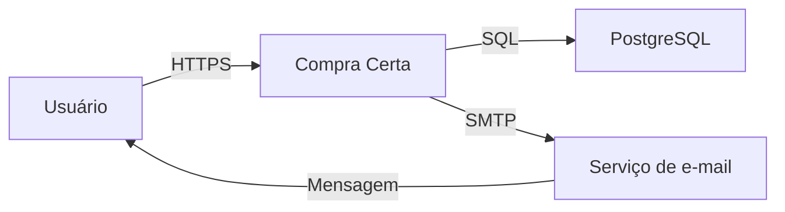
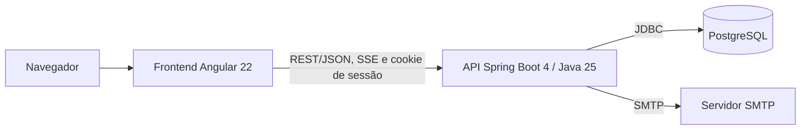
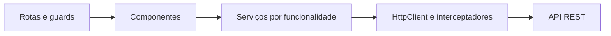
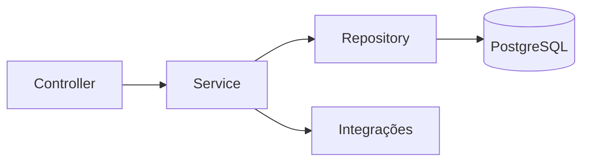
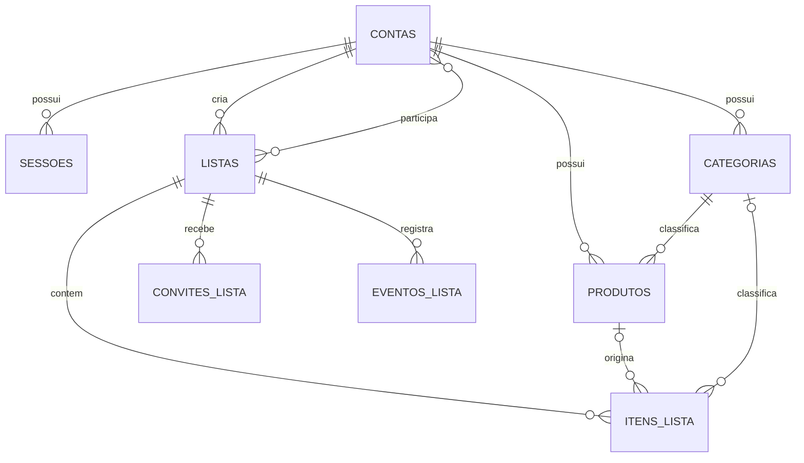
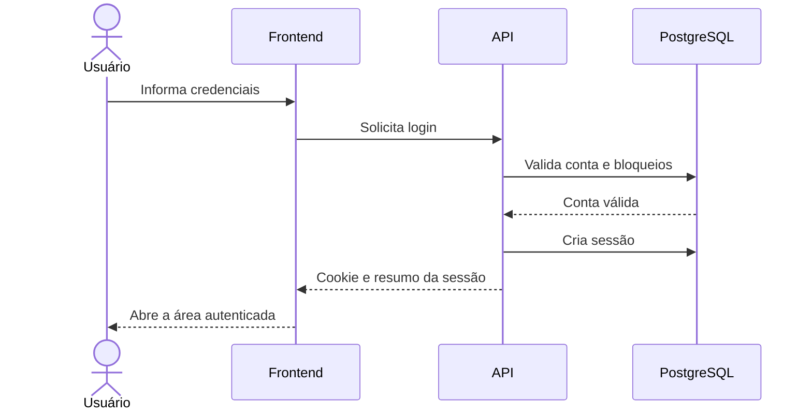
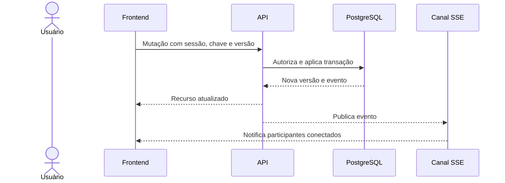
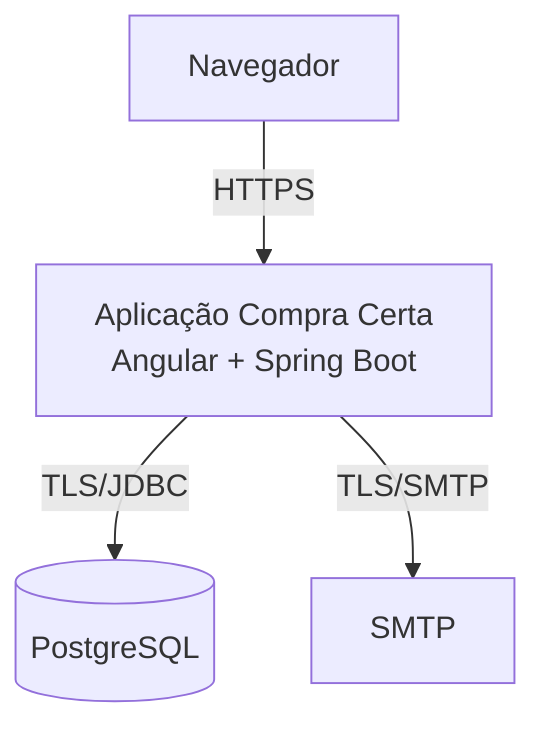

# Visão geral

O Compra Certa é uma aplicação web para criação, organização, execução e compartilhamento de listas de compras. Sua arquitetura utiliza um frontend Angular e uma API Spring Boot (ambas organizadas por funcionalidades) e um banco de dados PostgreSQL, com contratos REST/HTTP definidos em OpenAPI, buscando segurança, consistência dos dados, testabilidade e evolução independente entre frontend e backend.

## 2. Requisitos arquiteturalmente significativos

- **Segurança e privacidade:** autenticar usuários, proteger credenciais e dados pessoais, impedir acesso não autorizado às listas e mitigar vulnerabilidades comuns em aplicações web.
- **Consistência e concorrência:** preservar a integridade das listas e detectar alterações concorrentes, permitindo que conflitos sejam resolvidos de forma clara.
- **Operação com conexão instável:** manter o estado da interação durante falhas temporárias de comunicação e retomar a sincronização com segurança.
- **Desempenho:** responder adequadamente às operações interativas de consulta e manutenção de listas, itens, categorias e produtos.
- **Disponibilidade e recuperação:** detectar indisponibilidades e evitar perda ou corrupção de dados após falhas.
- **Manutenibilidade e evolução:** desacoplar frontend e backend pelo contrato OpenAPI e organizar o código por funcionalidade, com responsabilidades bem definidas.
- **Testabilidade:** permitir testes unitários, de integração, funcionais e de ponta a ponta, com dependências externas isoladas e ambientes reproduzíveis.
- **Observabilidade:** disponibilizar registros e indicadores de saúde suficientes para diagnosticar falhas sem expor dados sensíveis.

## 3. Contexto do sistema

O Compra Certa atende usuários que mantêm listas individuais ou colaborativas pelo navegador. O sistema persiste os dados no PostgreSQL e usa um serviço SMTP para enviar mensagens de recuperação de senha e convites.

| Elemento | Responsabilidade |
|---|---|
| Usuário | Criar uma conta e administrar listas, itens, categorias, produtos e compartilhamentos. |
| Compra Certa | Aplicar as regras de negócio, controlar o acesso e apresentar a interface web. |
| PostgreSQL | Persistir dados transacionais, sessões, idempotência e histórico de eventos. |
| Serviço de e-mail | Entregar mensagens de recuperação de senha e convites para listas. |

## 4. Visão de contêineres

| Contêiner | Responsabilidade | Tecnologia |
|---|---|---|
| Frontend | Interface, navegação, validações de interação e coordenação das chamadas à API. | Angular 22, TypeScript e RxJS. |
| Backend | Autenticação, autorização, regras de negócio, transações e integrações. | Spring Boot 4 e Java 25. |
| Banco de dados | Persistência relacional e restrições de integridade. | PostgreSQL e Flyway. |
| Serviço de e-mail | Entrega de mensagens transacionais. | SMTP; Mailpit no ambiente local de testes. |
| Contrato de API | Acordo independente entre frontend e backend. | OpenAPI em `docs/api/openapi.yaml`. |

O repositório é um monorepositório. Em produção, o backend também pode servir os arquivos estáticos da aplicação Angular e encaminhar rotas da Single Page Application (SPA) para seu arquivo principal.

## 5. Arquitetura do frontend

O frontend é uma SPA composta por componentes standalone, organizada por funcionalidades. Componentes, diretivas e pipes não acessam o servidor diretamente; toda comunicação HTTP fica encapsulada em serviços.

### 5.1 Organização

| Área | Responsabilidade |
|---|---|
| `auth` | Cadastro, login, recuperação, redefinição de senha, sessão, guards e proteção CSRF. |
| `listas` | Criação, consulta, edição, ciclo de vida, itens e sincronização de listas. |
| `categorias` | Administração do catálogo pessoal de categorias. |
| `produtos` | Administração do catálogo pessoal de produtos. |
| `compartilhamento` | Convites, aceite e administração de participantes. |
| `layout-interno` | Estrutura e navegação da área autenticada. |
| `shared` | Recursos reutilizáveis e cabeçalhos aplicados às mutações. |

### 5.2 Camadas e dependências

- As rotas públicas abrangem cadastro, login, recuperação, redefinição e aceite de convite.
- As rotas de listas, categorias e produtos são protegidas pelo guard de sessão.
- O guard de visitante impede que uma sessão ativa retorne às telas de entrada.
- O interceptador de CSRF adiciona a proteção exigida às requisições mutáveis.
- Operações mutáveis enviam chave de idempotência e, quando aplicável, versão esperada do recurso.
- A sincronização de listas consome eventos do servidor e atualiza a apresentação sem concentrar regras de negócio nos componentes.
- Interceptadores de simulação são restritos ao modo de desenvolvimento e não compõem a configuração de produção.

### 5.3 Estado e erros

O estado permanece local aos componentes ou aos serviços responsáveis pela funcionalidade. A sessão autenticada é centralizada no serviço de sessão. Erros HTTP são convertidos em mensagens claras, sem expor detalhes internos.
Conflitos de versão não são sobrescritos silenciosamente: a interface informa a divergência e solicita uma nova decisão do usuário.

## 6. Arquitetura do backend

O backend é um monólito modular organizado por funcionalidade. Cada módulo contém seus próprios controladores, serviços, contratos de entrada e saída e repositórios. O fluxo padrão é:

- **Controllers:** traduzem HTTP, validam a forma da entrada e constroem a resposta.
- **Services:** aplicam regras de negócio, autorização funcional, idempotência e limites transacionais.
- **Repositories:** encapsulam consultas e persistência.
- **Integrações:** são acessadas por interfaces, permitindo substituição por implementações indisponíveis ou
  doubles de teste.

### 6.1 Módulos

| Módulo | Responsabilidade |
|---|---|
| `autenticacao` | Conta, login, sessão, CSRF, recuperação de senha e idempotência de autenticação. |
| `listas` | Cadastro, consulta e alteração dos dados principais das listas. |
| `itens` | Inclusão, edição, exclusão e marcação dos itens. |
| `categorias` | Catálogo de categorias pertencente à conta. |
| `produtos` | Catálogo de produtos e associação com categorias. |
| `ciclodevida` | Conclusão, reabertura e exclusão lógica de listas. |
| `compartilhamento` | Convites, participantes e saída de listas. |
| `eventos` | Registro e publicação dos eventos de alteração das listas. |
| `comum` | Erros e recursos técnicos compartilhados, sem regras específicas de uma funcionalidade. |
| `configuracao` | Inicialização e integração da SPA com o servidor. |

Os módulos podem compartilhar identificadores e contratos mínimos, mas regras de uma funcionalidade devem ser
invocadas por seu serviço, evitando acesso direto às tabelas pertencentes a outro módulo.

## 7. Modelo de dados

- Identificadores de domínio são UUIDs.
- Listas e itens usam exclusão lógica para preservar consistência e sincronização.
- Listas, itens, categorias, produtos, convites e participações possuem versão para controle de concorrência.
- Itens preservam cópias dos nomes e da unidade usados no momento da inclusão, evitando alteração retroativa provocada pelo catálogo.
- Restrições e índices no banco impedem duplicidades relevantes e sustentam a ordenação das consultas.
- Operações idempotentes armazenam chave, escopo e impressão digital da requisição.
- Eventos de lista registram tipo, ator, versão, instante e dados necessários à sincronização.
- O esquema é versionado exclusivamente por migrações Flyway em `backend/src/main/resources/db/migration`.

## 8. Integrações e contratos

### 8.1 API HTTP

A API é versionada sob `/api/v1`, usa JSON para comandos e consultas e segue o contrato
`docs/api/openapi.yaml`. Alterações incompatíveis exigem nova versão ou período explícito de compatibilidade.

- `2xx` indica sucesso.
- `400` indica entrada inválida.
- `401` indica sessão ausente ou inválida.
- `403` indica operação não permitida.
- `404` evita revelar ou representa recurso inexistente.
- `409` representa duplicidade, conflito de versão ou reutilização incompatível de chave idempotente.
- Erros retornam código estável, mensagem adequada ao usuário e, quando aplicável, erros por campo.

### 8.2 Sessão, concorrência e idempotência

- A autenticação usa sessão opaca armazenada no servidor e cookie protegido no navegador.
- Operações protegidas validam a sessão e a permissão do usuário sobre o recurso.
- Mutações usam token CSRF conforme o contrato de autenticação.
- A versão esperada impede perda de atualização concorrente.
- A mesma chave idempotente e a mesma entrada reproduzem o resultado anterior; sua reutilização com outra entrada é rejeitada.
- Eventos de lista são publicados por Server-Sent Events (SSE), sem substituir a confirmação da operação REST.

### 8.3 E-mail

O backend acessa SMTP por abstrações próprias. Falhas de entrega são tratadas sem corromper a operação
transacional e sem revelar se um endereço está cadastrado durante a recuperação de senha.

## 9. Fluxos arquiteturais principais

### 9.1 Autenticação

### 9.2 Alteração colaborativa

### 9.3 Convite

O proprietário cria um convite; a API persiste somente o resumo seguro do token e solicita o envio por SMTP.
Ao abrir o link, o destinatário visualiza os dados permitidos e, após autenticação, aceita o convite. A API
valida token, validade, estado, identidade e versão antes de criar a participação.

### 9.4 Conflito e retomada

Se a versão enviada estiver desatualizada, a API rejeita a mutação com conflito. O frontend obtém o estado atual, mantém os dados ainda não confirmados e apresenta opções claras ao usuário. Após falha de rede, uma mutação pode ser reenviada com a mesma chave idempotente.

## 10. Segurança

- Senhas são armazenadas somente como hashes fortes e nunca são registradas em logs.
- Tokens de sessão, recuperação e convite têm alta entropia, validade limitada e armazenamento seguro; tokens recuperáveis não são persistidos em texto puro.
- Cookies de sessão usam `HttpOnly`, `Secure` em produção e política `SameSite` compatível com a aplicação.
- Requisições mutáveis são protegidas contra CSRF.
- Toda entrada é validada no servidor, independentemente das validações do frontend.
- Acesso a listas exige propriedade ou participação ativa; ações administrativas exigem propriedade.
- Mensagens de autenticação e recuperação evitam enumeração de contas.
- Tentativas sucessivas de login são limitadas e podem bloquear temporariamente a autenticação.
- Respostas e logs não expõem senhas, tokens, cookies, dados de conexão ou detalhes de exceções.
- Dependências e imagens de contêiner devem ser atualizadas e verificadas regularmente.

## 11. Implantação e execução

- Configurações variáveis são fornecidas por propriedades e variáveis de ambiente.
- Segredos não são versionados nem incorporados à imagem.
- O backend executa as migrações Flyway antes de atender requisições dependentes do esquema.
- A configuração local de apoio usa Docker Compose para PostgreSQL e Mailpit.
- O endpoint de saúde do Actuator é usado para verificar prontidão da aplicação.
- Frontend e backend podem ser executados separadamente no desenvolvimento; o proxy local encaminha chamadas à API.
- A implantação deve usar HTTPS, banco persistente, backup automatizado e credenciais distintas por ambiente.

## 12. Observabilidade

- Logs estruturados registram instante, nível, operação, resultado e identificador de correlação.
- Identificadores técnicos podem ser registrados; credenciais, tokens e conteúdo sensível são mascarados.
- O Actuator expõe apenas indicadores necessários, com acesso público limitado à saúde.
- Devem ser monitorados disponibilidade, latência, taxa de erros, uso do pool de conexões e falhas de e-mail.
- Alertas devem distinguir indisponibilidade externa de erro de regra de negócio.
- Eventos funcionais de lista atendem à sincronização e não substituem logs operacionais ou trilha de auditoria.

## 13. Estratégia de testes

| Nível | Escopo | Isolamento e ferramentas |
|---|---|---|
| Unitário frontend | Componentes, guards, interceptadores e serviços. | Dependências substituídas por stubs ou spies; Vitest e Testing Library. |
| Integração frontend | Interação entre componentes, rotas e serviços. | Servidor externo simulado; Playwright. |
| Unitário backend | Controllers, services, validações e adaptadores. | Colaboradores imediatos substituídos; JUnit. |
| Integração backend | HTTP, serviços, persistência e transações. | Dependências externas controladas; Spring Test e Testcontainers. |
| End-to-end | Jornada completa pelo navegador e API reais. | Angular, Spring Boot e PostgreSQL integrados; Playwright. |

Os testes seguem as definições de `docs/testes` e são implementados em ciclos TDD. Cada teste deve se relacionar a uma especificação funcional ou requisito não funcional. Testes de rota cobrem acesso público, acesso protegido, parâmetros e redirecionamentos. Migrações são verificadas contra um PostgreSQL compatível com produção.

## 14. Restrições e riscos

### 14.1 Restrições

- O sistema depende de um navegador moderno com suporte às APIs utilizadas pelo Angular e a SSE.
- O banco relacional PostgreSQL é a fonte de verdade.
- Frontend e backend devem permanecer compatíveis com o contrato OpenAPI publicado.
- A organização por funcionalidade e a separação entre controllers, services e repositories são obrigatórias.

### 14.2 Riscos

| Risco | Tratamento |
|---|---|
| Atualizações simultâneas sobrescreverem dados | Versões, respostas de conflito e idempotência. |
| Queda de conexão duplicar operações | Reenvio com a mesma chave idempotente. |
| SSE perder notificações | Reconciliação pelo estado persistido e versão da lista. |
| SMTP ficar indisponível | Registro do resultado, mensagem neutra e possibilidade controlada de reenvio. |
| Crescimento do histórico de eventos | Política de retenção e índices, definida antes de atingir impacto operacional. |
| Acoplamento entre funcionalidades | Dependências por serviços e revisão periódica dos limites dos módulos. |