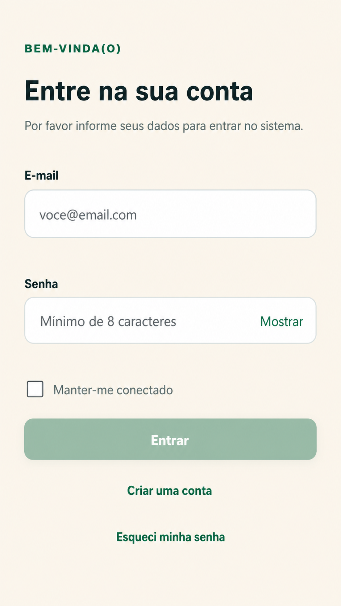
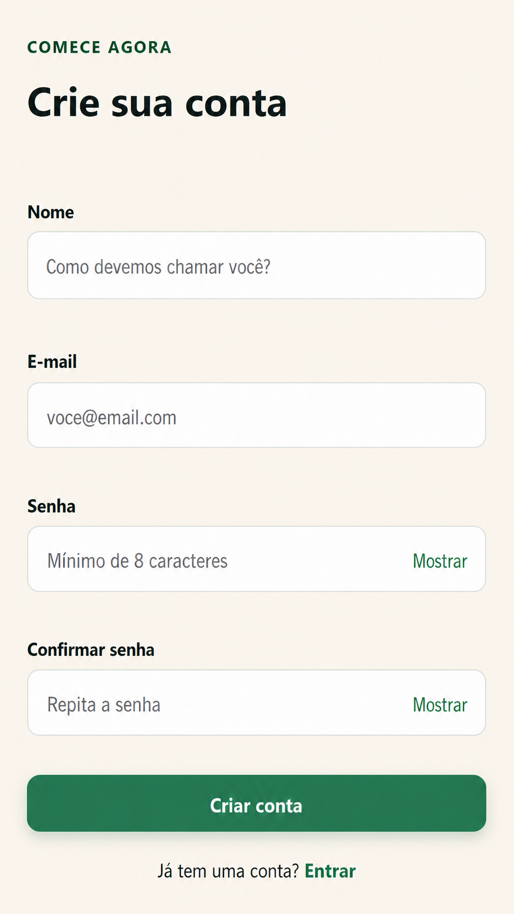

# EF-01 — Autenticação e conta

## Visão geral

Permitir que visitantes criem uma conta, autentiquem-se, encerrem a sessão e recuperem a senha com segurança. Após login, o usuário acessa a rota originalmente solicitada ou, na ausência dela, “Minhas Listas”. Após cadastro, acessa uma página vazia com o título “Minhas Listas”.

**Atores:** visitante que ainda não entrou e usuário autenticado com conta habilitada.

## Imagens

### Login

### Cadastro

## Requisitos

- **Tela “Crie sua conta” (imagem Cadastro)**
  - **Campo “Nome”**
    - Obrigatório.
    - Quando não informado ou composto somente por espaços, exibe “Por favor, informe seu nome”.
    - Aceita de 2 a 100 caracteres.
    - Preserva a capitalização informada.
  - **Campo “E-mail”**
    - Obrigatório.
    - Aceita um endereço válido com até 254 caracteres.
    - Quando não informado corretamente, exibe “Por favor, informe um e-mail válido”.
    - O sistema normaliza o endereço para minúsculas antes de verificar duplicidade; essa regra deve ser garantida pelo backend.
  - **Campo “Senha”**
    - Obrigatório.
    - Aceita de 8 a 128 caracteres, inclusive espaços, sem removê-los.
  - **Campo “Confirmar senha”**
    - Obrigatório.
    - Deve ser idêntico ao campo “Senha”.
  - **Controles “Mostrar/Ocultar”**
    - Alternam somente a visualização dos campos “Senha” e “Confirmar senha”.
    - Preservam o conteúdo digitado.
  - **Botão “Criar conta”**
    - Valida todos os campos antes de concluir o cadastro.
    - Se o e-mail já estiver cadastrado, não cria outra conta, não autentica o visitante e exibe o pop-up “E-mail já foi cadastrado”.
    - Em caso de falha, não cria conta parcialmente e exibe “Ocorreu um erro ao tentar criar sua conta. Aguarde e tente novamente em alguns instantes.”.
    - Em caso de sucesso, cria somente a conta, autentica o novo usuário e abre a tela “Minhas Listas”.
    - Enquanto processa o cadastro, não permite novo envio.
  - **Link “Entrar”**
    - Abre a tela “Entre na sua conta”.

- **Tela “Entre na sua conta” (imagem Login)**
  - **Campo “E-mail”**
    - Obrigatório.
    - Aceita um endereço válido com até 254 caracteres.
    - Não diferencia letras maiúsculas e minúsculas ao localizar a conta.
  - **Campo “Senha”**
    - Obrigatório.
    - Exibe o placeholder “Mínimo de 8 caracteres”.
  - **Controle “Mostrar/Ocultar”**
    - Alterna somente a visualização da senha e preserva o conteúdo digitado.
  - **Checkbox “Manter-me conectado”**
    - Inicia desmarcado.
    - Desmarcado: o acesso expira após 12 horas sem atividade e, no máximo, após 24 horas.
    - Marcado: mantém o usuário conectado no mesmo navegador por até 30 dias, salvo se ele sair manualmente.
  - **Botão “Entrar”**
    - Dados incorretos exibem “E-mail ou senha inválidos”, sem indicar qual campo está incorreto.
    - Após 5 tentativas malsucedidas em 15 minutos, impede novas tentativas por 15 minutos e exibe “Muitas tentativas de acesso. Tente novamente em 15 minutos”.
    - Em caso de sucesso, abre a página solicitada anteriormente ou “Minhas Listas”.
    - Enquanto processa o login, não permite novo envio.
  - **Link “Criar uma conta”**
    - Abre a tela “Crie sua conta”.
  - **Link “Esqueci minha senha”**
    - Abre a tela de recuperação de senha.

- **Tela de recuperação de senha**
  - **Campo “E-mail”**
    - Obrigatório e deve conter um endereço válido.
  - **Botão de envio**
    - Sempre exibe “Se houver uma conta para este e-mail, enviaremos as instruções”, exista ou não uma conta cadastrada.
    - Para uma conta existente, envia um link de uso único, válido por 30 minutos.
    - Um novo pedido torna inválidos os links enviados anteriormente.
    - Enquanto processa a solicitação, não permite novo envio.

- **Tela de redefinição de senha**
  - **Campo “Nova senha”**
    - Obrigatório e aceita de 8 a 128 caracteres.
  - **Campo “Confirmar nova senha”**
    - Obrigatório e deve ser idêntico ao campo “Nova senha”.
  - **Controles “Mostrar/Ocultar”**
    - Alternam somente a visualização e preservam o conteúdo digitado.
  - **Botão de confirmação**
    - Link inválido, usado ou expirado não altera a senha e oferece nova solicitação.
    - Em caso de sucesso, altera a senha, encerra os acessos abertos em outros dispositivos e abre a tela de login.
    - Enquanto processa a alteração, não permite novo envio.

- **Tela “Minhas Listas” após o cadastro**
  - Exibe somente o título “Minhas Listas”.
  - Não exibe listas ou outros conteúdos neste incremento.

- **Navegação e encerramento do acesso**
  - Pessoa não autenticada que abre uma página interna é direcionada ao login e, após entrar, retorna à página solicitada.
  - Pessoa já autenticada que abre login ou cadastro é direcionada para “Minhas Listas”.
  - Ao sair, abrir a tela de login e exigir nova autenticação para acessar páginas internas.
  - Voltar no navegador após sair não pode revelar dados protegidos.

- **Comportamentos comuns dos formulários**
  - Possuem estados inicial, erro por campo, processamento, sucesso e erro geral.
  - Erros preservam nome e e-mail preenchidos, mas não precisam preservar senhas.
  - Campos, mensagens e controles devem ser perceptíveis e operáveis por teclado e tecnologias assistivas.

## Critérios de aceite

1. Cadastro válido cria uma única conta, autentica o usuário e abre uma página vazia com o título “Minhas Listas”.
2. E-mail já usado, inclusive com caixa diferente, e confirmação divergente não persistem dados.
3. Login válido mantém o usuário conectado após recarregar a página; dados inválidos não revelam se o e-mail possui conta.
4. O checkbox “Manter-me conectado” e o bloqueio temporário respeitam os prazos definidos.
5. Após sair, qualquer página interna volta a exigir login.
6. Recuperação para e-mail existente e inexistente produz resposta visual indistinguível.
7. Link inválido, usado ou expirado não altera a senha; redefinição válida encerra acessos anteriores.
8. Senhas e links de recuperação não são exibidos em mensagens ou na URL após o uso.
9. Controles são operáveis por teclado, possuem nomes acessíveis e não dependem somente de cor.

## Contrato de API (futura OpenAPI)

### Endpoints

| Método e rota | Propósito | Autenticação | Entrada | Sucesso |
|---|---|---|---|---|
| `POST /api/v1/auth/registrations` | Criar conta e autenticar o novo usuário | Pública | `RegistrationRequest` + `Idempotency-Key` | `201 SessionResponse` + cookie |
| `POST /api/v1/auth/sessions` | Autenticar uma conta existente | Pública | `LoginRequest` | `200 SessionResponse` + cookie |
| `GET /api/v1/auth/session` | Recuperar o usuário autenticado e a validade do acesso | Sessão | — | `200 SessionResponse` |
| `DELETE /api/v1/auth/sessions/current` | Encerrar o acesso atual | Sessão + CSRF | — | `204` + cookie expirado |
| `POST /api/v1/auth/password-reset-requests` | Solicitar o link de recuperação | Pública | `PasswordResetRequest` + `Idempotency-Key` | `202` |
| `POST /api/v1/auth/password-resets` | Definir uma nova senha pelo link recebido | Pública | `PasswordResetConfirmation` + `Idempotency-Key` | `204` |

### Schemas

| Schema | Campos e regras |
|---|---|
| `UserSummary` | Resumo do usuário autenticado, usado em `SessionResponse.user`: `id: uuid`, `name`, `email`, `status: ACTIVE`, `createdAt: date-time`; nunca inclui segredo |
| `RegistrationRequest` | `name`, `email`, `password`, `passwordConfirmation`; todos obrigatórios |
| `LoginRequest` | `email`, `password`, `manterConectado: boolean`; `manterConectado` recebe o estado do checkbox “Manter-me conectado” |
| `SessionResponse` | `user: UserSummary`, `csrfToken`, `expiresAt`; todos obrigatórios |
| `PasswordResetRequest` | `email` obrigatório |
| `PasswordResetConfirmation` | `token`, `newPassword`, `passwordConfirmation`; todos obrigatórios |

`SessionResponse` é retornado pelo cadastro, login e consulta do acesso atual. Seu campo `user`, no formato `UserSummary`, permite ao frontend identificar o usuário autenticado e apresentar nome e e-mail sem consultar outro endpoint.

Regras contratuais:

- E-mail duplicado retorna `409 CONFLICT`, com `fieldErrors: [{ "field": "email", "message": "E-mail já foi cadastrado" }]`. O frontend apresenta essa mensagem em um pop-up e mantém o usuário no cadastro.
- Login inválido retorna `401`, com `detail: "E-mail ou senha inválidos"`. Durante o bloqueio temporário, retorna `429`, `Retry-After` em segundos e a mensagem definida nas regras funcionais.
- Pedido de recuperação com e-mail sintaticamente válido retorna sempre `202`, exista ou não conta. Link inválido, usado ou expirado retorna `400`, sem alterar a senha.
- O link de recuperação coloca o token no fragmento da URL; o frontend o envia somente no corpo HTTPS.
- Responses de sessão usam `Cache-Control: no-store` e `Set-Cookie: cc_session=...; HttpOnly; Secure; SameSite=Lax; Path=/api/v1`. Logout expira o mesmo cookie.
- `GET /auth/session` pode renovar `csrfToken`.
- Senhas não são retornadas pela API, registradas em logs nem armazenadas de forma reversível.

## Definições de testes funcionais (Playwright)

| ID | Pri. | Preparação | Ação | Resultado |
|---|---:|---|---|---|
| `AUTH-001` | P0 | Visitante e e-mail novo | Cadastrar dados válidos | Uma conta, usuário autenticado, página vazia com o título “Minhas Listas” e acesso mantido após recarga |
| `AUTH-002` | P0 | Cadastro aberto | Testar obrigatório vazio, e-mail inválido, senhas com 7 e 129 caracteres e confirmação divergente | Erro no campo; nenhuma conta criada e visitante não autenticado |
| `AUTH-003` | P0 | Conta `Pessoa@Exemplo.com` | Cadastrar `pessoa@exemplo.com` | Pop-up “E-mail já foi cadastrado”; nenhuma conta adicional e visitante não autenticado |
| `AUTH-004` | P0 | Conta ativa e rota interna solicitada | Entrar, sair e usar Voltar | Retorna à rota guardada; após logout, rotas e cache não revelam dados |
| `AUTH-005` | P0 | Conta ativa | Tentar senha errada e e-mail inexistente | “E-mail ou senha inválidos” nos dois casos, sem revelar se a conta existe |
| `AUTH-008` | P0 | E-mails existente e inexistente; caixa de teste vazia | Solicitar recuperação para ambos | Respostas indistinguíveis; somente o existente recebe link válido |
| `AUTH-009` | P0 | Acesso aberto em outro dispositivo e link válido | Redefinir; reutilizar o link e testar acessos e senhas antiga/nova | Link e acesso anterior deixam de funcionar; somente a nova senha permite entrar |
| `AUTH-010` | P0 | Link expirado e link inválido | Tentar redefinir | Senha intacta, nenhum novo acesso e caminho para nova solicitação |
| `AUTH-006` | P1 | Conta e relógio controlado | Fazer 5 tentativas malsucedidas em 15 minutos; tentar antes e depois do bloqueio | Mensagem de excesso de tentativas durante 15 minutos; login permitido depois |
| `AUTH-007` | P1 | Relógio controlado | Entrar com o checkbox “Manter-me conectado” marcado e desmarcado e avançar o tempo | Acesso expira em 12 h sem atividade/24 h no máximo ou permanece por até 30 dias |
| `AUTH-011` | P2 | Desktop, mobile e navegadores suportados | Navegar por teclado, alternar senhas e enviar inválido | Ordem de foco, rótulos, estados e anúncios acessíveis |

## Fora do escopo específico

Termos de uso e consentimento associado, verificação obrigatória de e-mail, alteração de perfil/e-mail, autenticação social ou multifator e exclusão de conta.
