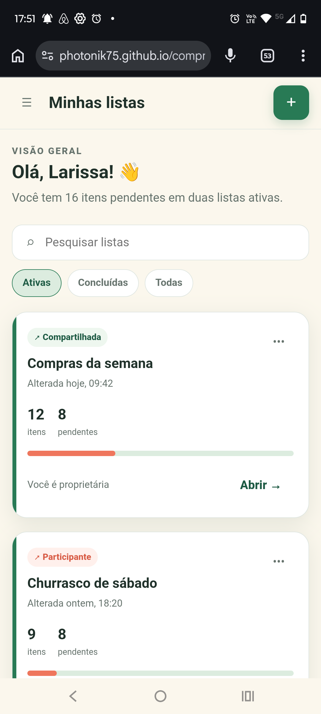
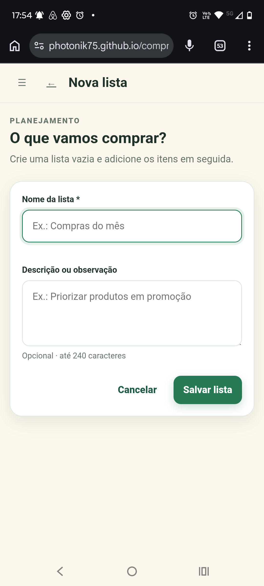

# EF-02 — Gestão básica de listas

## Visão geral

Permitir que o usuário consulte, pesquise e filtre as listas às quais tem acesso, crie uma lista vazia e altere
os dados básicos das listas ativas das quais é proprietário.

## Imagens

|  |  |
|:---:|:---:|
| Figura 1: Minhas listas | Figura 2: Nova lista |

## Requisitos

- **Tela “Minhas listas” (Figura 1)**
  - Exibe todas as listas não excluídas das quais o usuário é proprietário ou participante.
  - Exibe inicialmente somente as listas ativas.
  - Ordena as listas pela última alteração, da mais recente para a mais antiga.
  - Quando duas listas possuem a mesma data de alteração, mantém uma ordenação estável.
  - Quando houver mais de 30 resultados, carrega os resultados em páginas sem repetir listas.
  - **Cabeçalho**
    - Exibe o título “Minhas listas”.
    - Exibe a quantidade total de listas ativas acessíveis ao usuário.
    - Exibe a soma dos itens pendentes de todas as listas ativas acessíveis ao usuário.
    - **Botão “Nova lista”**
      - Abre a tela “Nova lista”.
  - **Campo “Pesquisar listas”**
    - Pesquisa pelo nome da lista.
    - Considera correspondência parcial e ignora diferenças entre letras maiúsculas, minúsculas e acentos.
    - Aceita até 60 caracteres após a remoção de espaços excedentes.
    - Atua em conjunto com o filtro selecionado e sobre todas as listas, inclusive as ainda não carregadas.
    - Quando não encontra resultados, exibe “Nenhuma lista encontrada para esta pesquisa.” e a ação
      “Limpar pesquisa”.
  - **Filtros**
    - **Filtro “Ativas”**
      - Inicia selecionado.
      - Exibe somente listas ativas.
      - Sem resultados, exibe “Você não possui listas ativas.” e a ação “Criar lista”.
    - **Filtro “Concluídas”**
      - Exibe somente listas concluídas.
      - Sem resultados, exibe “Você não possui listas concluídas.”.
    - **Filtro “Todas”**
      - Exibe listas ativas e concluídas.
  - **Conjunto de cartões**
    - Quando o usuário não possui nenhuma lista acessível, exibe “Você ainda não possui listas. Crie sua
      primeira lista para começar.” e a ação “Criar lista”.
    - **Cartão de lista**
      - Exibe nome, estado, última alteração, papel do usuário, total de itens, itens pendentes e percentual
        concluído.
      - Calcula os totais e o percentual somente com itens não excluídos.
      - Identifica o usuário como “Proprietário” quando criou a lista e como “Participante” nos demais casos.
      - **Ação “Abrir”**
        - Para lista ativa, abre seu detalhe em modo de uso.
        - Para lista concluída, abre seu detalhe em modo de consulta.
        - Quando a lista não existe, foi excluída ou não está acessível ao usuário, exibe
          “Lista não encontrada ou indisponível para sua conta.”.
      - **Ação “Editar”**
        - É exibida somente para o proprietário de uma lista ativa.
        - Abre a tela “Editar lista”.

- **Tela “Nova lista” (Figura 2)**
  - Cria uma lista ativa, vazia e com o usuário autenticado como proprietário.
  - **Campo “Nome da lista”**
    - Obrigatório.
    - Aceita de 1 a 60 caracteres após a remoção de espaços excedentes.
    - O nome deve ser único entre as listas não excluídas pertencentes ao usuário.
    - Listas das quais o usuário é apenas participante não impedem o uso do mesmo nome.
    - Quando vazio, exibe “Por favor, informe o nome da lista.”.
    - Quando excede o limite, exibe “O nome da lista deve ter no máximo 60 caracteres.”.
    - Quando já utilizado, exibe “Você já possui uma lista com este nome.”.
  - **Campo “Descrição ou observação”**
    - Opcional.
    - Aceita até 240 caracteres.
    - Quando excede o limite, exibe “A descrição deve ter no máximo 240 caracteres.”.
  - **Botão “Salvar lista”**
    - Valida os campos antes de criar a lista.
    - Enquanto processa a criação, não permite novo envio.
    - Cliques repetidos criam somente uma lista.
    - Em caso de sucesso, abre o detalhe da nova lista.
    - Em caso de falha inesperada, preserva o formulário e exibe
      “Não foi possível criar a lista. Tente novamente em alguns instantes.”.
  - **Ação “Cancelar”**
    - Volta à tela “Minhas listas” sem criar uma lista.

- **Tela “Editar lista” (Variação Figura 2)**
  - É acessível somente ao proprietário de uma lista ativa.
  - Exibe os dados atuais da lista.
  - Um participante não visualiza a ação de edição e não pode alterar os dados por acesso direto.
  - Quando a lista estiver concluída, não permite a alteração e exibe
    “Esta lista está concluída e não pode ser editada.”.
  - **Campo “Nome da lista”**
    - Aplica as mesmas regras e mensagens definidas na tela “Nova lista”.
    - Ignora a própria lista ao verificar a unicidade do nome.
  - **Campo “Descrição ou observação”**
    - Aplica as mesmas regras e mensagens definidas na tela “Nova lista”.
    - Permite remover a descrição.
  - **Botão “Salvar alterações”**
    - Salva somente quando há mudança no nome ou na descrição.
    - Enquanto processa a alteração, não permite novo envio.
    - Em caso de sucesso, atualiza a data da última alteração, incrementa a versão e abre o detalhe da lista.
    - Quando outra alteração foi salva depois da abertura do formulário, não sobrescreve os dados mais
      recentes e exibe “Esta lista foi alterada em outro lugar. Recarregue os dados para continuar.”.
    - Oferece a ação “Recarregar dados” após um conflito.
    - Em caso de falha inesperada, preserva o formulário e exibe
      “Não foi possível salvar as alterações. Tente novamente em alguns instantes.”.
  - **Ação “Cancelar”**
    - Volta ao detalhe da lista sem persistir alterações.

## Requisitos não funcionais

- O frontend deve encapsular a comunicação HTTP em serviços; componentes, diretivas e pipes não acessam o
  servidor diretamente.
- O backend deve separar Controllers, Services e Repositories em pacotes da funcionalidade de listas.
- Criações devem ser idempotentes e alterações concorrentes devem usar controle otimista por versão.
- Consultas paginadas devem manter ordenação determinística e não repetir nem omitir listas.
- As telas devem usar as rotas `/listas`, `/listas/nova`, `/listas/{listId}` e
  `/listas/{listId}/editar`, protegidas por sessão; identificadores inválidos ou inacessíveis devem usar o
  mesmo tratamento polido de indisponibilidade.
- Controles, mensagens, carregamento e erros devem ser perceptíveis e operáveis por teclado e tecnologias
  assistivas.

## Contrato de API

Todos os endpoints exigem sessão autenticada. As mutações exigem proteção CSRF.

### Endpoints

| Método e rota | Entrada | Sucesso |
|---|---|---|
| `GET /api/v1/lists` | Query `status`, `search`, `cursor`, `limit` | `200 ListCollection` |
| `POST /api/v1/lists` | `CreateListRequest` e `Idempotency-Key` | `201 ListDetail`, `Location` e `ETag` |
| `GET /api/v1/lists/{listId}` | Path `listId: uuid` | `200 ListDetail` e `ETag` |
| `PATCH /api/v1/lists/{listId}` | `UpdateListRequest` e `If-Match` | `200 ListDetail` e novo `ETag` |

### Consulta da coleção

- `status`: `ACTIVE` por padrão, `COMPLETED` ou `ALL`.
- `search`: opcional e limitado a 60 caracteres após normalização.
- `limit`: máximo de 30 resultados por página.
- Ordenação: `updatedAt` decrescente e `id` crescente para desempate.
- O cursor incorpora filtros e ordenação e não pode ser reutilizado com parâmetros diferentes.
- O resumo da coleção considera todas as listas ativas acessíveis, independentemente de pesquisa, filtro ou
  paginação.

### Schemas

| Schema | Campos e regras |
|---|---|
| `CreateListRequest` | `name: string` obrigatório, de 1 a 60; `description: string \| null` opcional, até 240 |
| `UpdateListRequest` | `name` e `description` opcionais; deve conter ao menos uma mudança; `description: null` remove a descrição |
| `UserReference` | `id: uuid` e `name: string`, ambos obrigatórios |
| `ListSummary` | `total`, `checked`, `pending` e `percentage`: inteiros obrigatórios e não negativos; `percentage` entre 0 e 100 |
| `ListCard` | `id`, `name`, `status`, `role`, `owner`, `shared`, `summary`, `updatedAt`, `completedAt`, `version` |
| `ListCollection` | `items: ListCard[]`, `page: PageInfo` e `summary: CollectionSummary` |
| `PageInfo` | `nextCursor: string \| null` e `hasMore: boolean` |
| `CollectionSummary` | `activeLists` e `pendingItems`: inteiros obrigatórios e não negativos |
| `ListDetail` | `id`, `name`, `description`, `status`, `owner`, `role`, `shared`, `summary`, `createdAt`, `updatedAt`, `completedAt`, `version` |

`ListStatus` aceita `ACTIVE` e `COMPLETED`. `ListRole` aceita `OWNER` e `EDITOR`. Datas usam UTC no formato
`date-time`. `version` é um inteiro usado para gerar o `ETag`.

`PATCH` aceita somente `name` e `description`. O envio de `status`, `ownerId`, contadores ou propriedades
desconhecidas retorna `400 VALIDATION_ERROR`.

### Erros

| Situação | Status e código |
|---|---|
| Dados inválidos | `400 VALIDATION_ERROR` com `fieldErrors` contendo as mensagens definidas nos requisitos |
| Nome de lista própria já utilizado | `409 LIST_NAME_ALREADY_IN_USE` |
| Lista inexistente, excluída ou inacessível | `404 NOT_FOUND` |
| Edição solicitada por participante | `403 FORBIDDEN` |
| Edição de lista concluída | `409 LIST_COMPLETED` |
| Versão desatualizada | `409 CONFLICT` com o `ETag` atual |
| Reutilização incompatível da chave idempotente | `409 IDEMPOTENCY_KEY_REUSED` |

## Testes de validação

| ID | Pri. | Preparação | Ação | Resultado |
|---|---:|---|---|---|
| `LIST-001` | P0 | Proprietário autenticado sem lista homônima | Criar lista válida com duplo clique em salvar | Uma única lista ativa e vazia é criada e permanece após recarga |
| `LIST-002` | P0 | Lista própria “Compras do mês” | Criar ou editar com nome vazio, longo ou equivalente ao existente e descrição longa | Mensagem normativa no campo, formulário preservado e nenhuma alteração persistida |
| `LIST-003` | P1 | Participante de “Viagem” pertencente a outra pessoa | Criar lista própria “Viagem” | Criação aceita e papéis corretamente identificados |
| `LIST-004` | P0 | Listas com estados, datas, papéis e itens conhecidos | Abrir “Minhas listas” | Somente ativas inicialmente, ordenação correta e resumos consistentes |
| `LIST-005` | P1 | Listas “Farmácia”, “FARMACIA antiga” e “Mercado” em estados distintos | Pesquisar “farmacia” e alternar filtros | Pesquisa ignora caixa e acentos e permanece combinada ao filtro |
| `LIST-006` | P1 | Usuário sem listas, filtro vazio e pesquisa sem correspondência | Abrir cada estado | Mensagem e ação específicas, sem cartão fictício |
| `LIST-007` | P0 | Lista ativa própria | Alterar nome e descrição, salvar e recarregar | Dados atualizados, nova ordenação e somente uma nova versão |
| `LIST-008` | P0 | Lista ativa compartilhada com participante | Abrir detalhe e tentar alteração por requisição direta | Ação ausente, resposta `FORBIDDEN` e dados preservados |
| `LIST-009` | P1 | Formulários de criação e edição alterados | Cancelar cada formulário | Nenhum dado persistido e retorno à tela esperada |
| `LIST-010` | P0 | Mesma lista aberta em dois contextos | Salvar em ambos, usando versão antiga no segundo | Conflito informado, primeira alteração preservada e ação para recarregar |
| `LIST-011` | P1 | Mais de 30 listas e correspondência após a primeira página | Pesquisar e filtrar a correspondência | Item encontrado, ordenação global correta e nenhuma duplicata |
| `LIST-012` | P0 | Lista inexistente, excluída ou inacessível | Tentar abrir cada recurso | Mensagem polida de indisponibilidade sem revelar sua existência |
