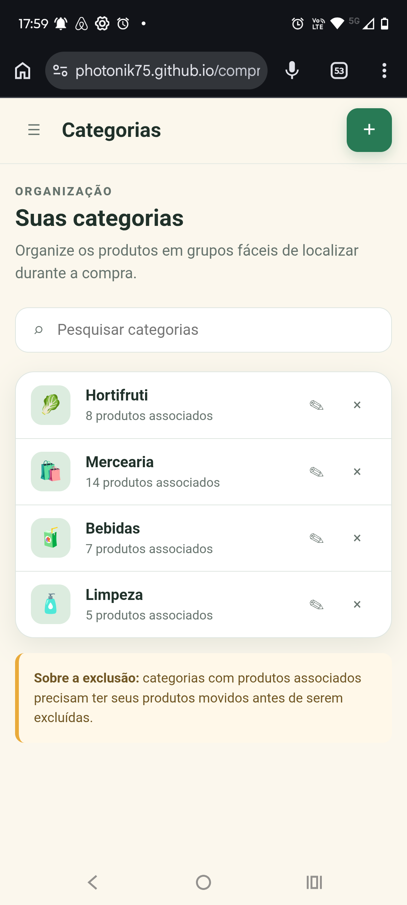
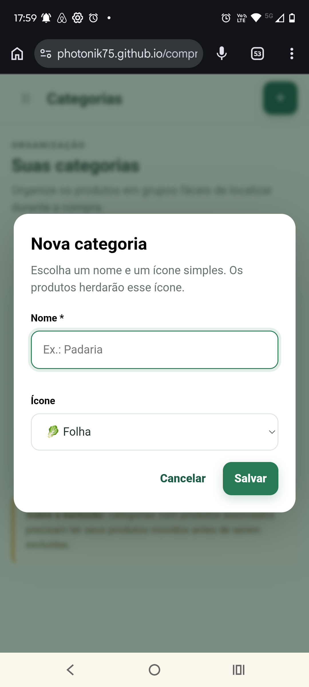
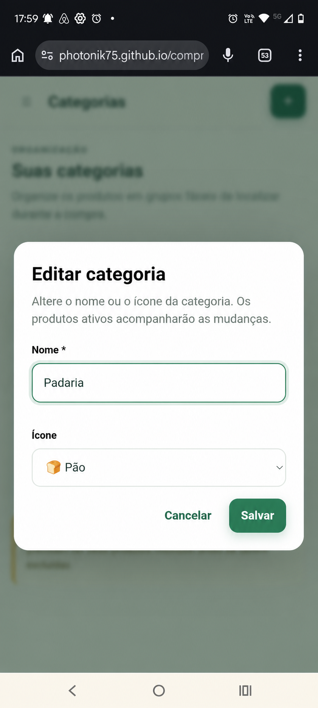

# EF-03 — Gestão de categorias

## Visão geral

Permitir que cada usuário organize seu catálogo pessoal em categorias reutilizáveis, podendo consultar,
pesquisar, criar, editar e excluir categorias sem produtos ativos associados.

## Imagens

|  |  |  |
|---|---|---|
| **Figura 1:** Tela “Categorias” | **Figura 2:** Diálogo “Nova categoria” | **Figura 3:** Diálogo “Editar categoria” |

## Requisitos

- **Tela “Categorias” (Figura 1)**
  - Exibe somente as categorias não excluídas pertencentes ao usuário autenticado.
  - Ordena as categorias pelo nome conforme o idioma `pt-BR`.
  - Quando duas categorias possuem o mesmo nome para ordenação, mantém uma ordem estável.
  - Uma conta nova recebe exatamente estas categorias:
    - **Hortifruti**
      - Usa o ícone `🥬`.
    - **Mercearia**
      - Usa o ícone `🛍️`.
    - **Bebidas**
      - Usa o ícone `🧃`.
    - **Limpeza**
      - Usa o ícone `🧴`.
  - As categorias iniciais são criadas junto com a conta.
  - Uma falha na criação das categorias iniciais impede a confirmação do cadastro.
  - **Cabeçalho**
    - Exibe o título “Categorias”.
    - **Botão “Nova categoria”**
      - Abre o diálogo “Nova categoria”.
  - **Campo “Pesquisar categorias”**
    - Pesquisa pelo nome da categoria.
    - Considera correspondência parcial e ignora diferenças entre letras maiúsculas, minúsculas e acentos.
    - Aceita até 40 caracteres após a remoção de espaços excedentes.
    - Quando não encontra resultados, exibe “Nenhuma categoria encontrada para esta pesquisa.” e a ação
      “Limpar pesquisa”.
  - **Lista de categorias**
    - Quando não há categorias, exibe “Você ainda não possui categorias.” e a ação “Nova categoria”.
    - **Categoria**
      - Exibe o ícone, o nome e a quantidade de produtos ativos associados.
      - A contagem desconsidera produtos inativos ou excluídos.
      - **Ação “Editar”**
        - Abre o diálogo “Editar categoria” com os dados atuais.
      - **Ação “Excluir”**
        - Quando há produtos ativos associados, não exclui a categoria e exibe
          “Esta categoria possui {quantidade} produto(s) ativo(s). Mova ou desative esses produtos antes de
          excluí-la.”.
        - Quando não há produtos ativos associados, solicita confirmação.
        - A confirmação exibe “Excluir a categoria ‘{nome}’?” e informa que ela deixará de aparecer no
          catálogo e nas seleções.
        - Após a confirmação, exclui logicamente a categoria e a remove da lista e das seleções.
        - Produtos inativos e itens de listas já existentes preservam o nome e o ícone registrados antes da
          exclusão.
        - Em caso de falha inesperada, preserva a categoria e exibe
          “Não foi possível excluir a categoria. Tente novamente em alguns instantes.”.
  - **Aviso sobre exclusão**
    - Informa que categorias com produtos ativos associados somente podem ser excluídas depois que esses
      produtos forem movidos ou desativados.

- **Diálogo “Nova categoria” (Figura 2)**
  - Permite cadastrar uma categoria pertencente ao usuário autenticado.
  - **Campo “Nome”**
    - Obrigatório.
    - Aceita de 1 a 40 caracteres após a remoção de espaços excedentes.
    - Deve ser único entre as categorias não excluídas do usuário.
    - A verificação de duplicidade ignora caixa, acentos e espaços excedentes.
    - Quando vazio, exibe “Por favor, informe o nome da categoria.”.
    - Quando excede o limite, exibe “O nome da categoria deve ter no máximo 40 caracteres.”.
    - Quando já utilizado, exibe “Você já possui uma categoria com este nome.”.
  - **Campo “Ícone”**
    - Obrigatório.
    - Oferece os ícones `🥬`, `🛍️`, `🧃`, `🧴`, `🍞`, `❄️`, `🐾` e `🛒`.
    - Quando não informado ou inválido, exibe “Por favor, escolha um ícone disponível.”.
  - **Botão “Salvar”**
    - Valida os campos antes de criar a categoria.
    - Enquanto processa a criação, não permite novo envio.
    - Cliques repetidos criam somente uma categoria.
    - Em caso de sucesso, fecha o diálogo, exibe “Categoria criada com sucesso.” e inclui a categoria na
      posição correta da lista.
    - Em caso de falha inesperada, mantém o diálogo aberto, preserva os campos e exibe
      “Não foi possível criar a categoria. Tente novamente em alguns instantes.”.
  - **Botão “Cancelar”**
    - Fecha o diálogo sem criar a categoria.
    - Devolve o foco ao botão “Nova categoria”.
  - **Tecla `Esc`**
    - Tem o mesmo comportamento do botão “Cancelar”.

- **Diálogo “Editar categoria” (Figura 3)**
  - Permite alterar somente uma categoria pertencente ao usuário autenticado.
  - Exibe o nome e o ícone atuais.
  - **Campo “Nome”**
    - Aplica as mesmas regras e mensagens do campo “Nome” do diálogo “Nova categoria”.
    - Ignora a própria categoria ao verificar duplicidade.
  - **Campo “Ícone”**
    - Aplica as mesmas regras e mensagens do campo “Ícone” do diálogo “Nova categoria”.
  - **Botão “Salvar”**
    - Salva somente quando o nome ou o ícone foi alterado.
    - Enquanto processa a alteração, não permite novo envio.
    - Em caso de sucesso, fecha o diálogo, exibe “Categoria atualizada com sucesso.” e atualiza a lista.
    - Propaga o novo nome e o novo ícone aos produtos ativos associados.
    - Preserva o nome e o ícone registrados em produtos inativos e itens de listas já existentes.
    - Quando a categoria foi alterada após a abertura do diálogo, não sobrescreve os dados mais recentes e
      exibe “Esta categoria foi alterada em outro lugar. Recarregue os dados para continuar.”.
    - Oferece a ação “Recarregar dados” após um conflito.
    - Em caso de falha inesperada, mantém o diálogo aberto, preserva os campos e exibe
      “Não foi possível atualizar a categoria. Tente novamente em alguns instantes.”.
  - **Botão “Cancelar”**
    - Fecha o diálogo sem persistir alterações.
    - Devolve o foco à ação “Editar” que abriu o diálogo.
  - **Tecla `Esc`**
    - Tem o mesmo comportamento do botão “Cancelar”.

## Requisitos não funcionais

- O frontend deve encapsular a comunicação HTTP em serviços; componentes, diretivas e pipes não acessam o
  servidor diretamente.
- O backend deve separar Controllers, Services e Repositories em pacotes da funcionalidade de categorias.
- Criações devem ser idempotentes e alterações concorrentes devem usar controle otimista por versão.
- A alteração de categoria e a atualização dos produtos ativos associados devem ocorrer atomicamente.
- Controles, diálogos, mensagens e foco devem ser operáveis por teclado e tecnologias assistivas.

## Contrato de API

Todos os endpoints exigem sessão autenticada. As mutações exigem proteção CSRF. A categoria é sempre
associada ao usuário autenticado; requests não aceitam `userId`.

### Endpoints

| Método e rota | Propósito | Entrada | Sucesso |
|---|---|---|---|
| `GET /api/v1/categories` | Listar e pesquisar categorias | Query `search`, `cursor`, `limit` | `200 CategoryCollection` |
| `POST /api/v1/categories` | Criar categoria | `CategoryInput` e `Idempotency-Key` | `201 Category`, `Location` e `ETag` |
| `GET /api/v1/categories/{categoryId}` | Consultar categoria | Path `categoryId: uuid` | `200 Category` e `ETag` |
| `PATCH /api/v1/categories/{categoryId}` | Editar categoria | `CategoryPatch` e `If-Match` | `200 Category` e novo `ETag` |
| `DELETE /api/v1/categories/{categoryId}` | Excluir categoria sem produtos ativos | Path `categoryId: uuid` e `If-Match` | `204` |

### Schemas

| Schemas | Campos e Regras |
|---|---|
| `CategoryInput` | `name: string` e `icon: CategoryIcon`, ambos obrigatórios e não nulos |
| `CategoryPatch` | `name` e `icon` opcionais e não nulos; deve conter ao menos uma alteração |
| `CategoryIcon` | Um de `🥬`, `🛍️`, `🧃`, `🧴`, `🍞`, `❄️`, `🐾` ou `🛒` |
| `Category` | `id: uuid`, `name: string`, `icon: CategoryIcon`, `activeProductCount: integer`, `createdAt: date-time`, `updatedAt: date-time` e `version: integer` |
| `CategoryCollection` | `items: Category[]` e `page: PageInfo` |
| `PageInfo` | `nextCursor: string \| null` e `hasMore: boolean` |

`name` aceita de 1 a 40 caracteres após normalização. `activeProductCount` é obrigatório e não negativo.
Datas usam UTC. `version` é usado para gerar o `ETag`.

Na consulta, `search` é opcional, aceita até 40 caracteres e ignora caixa e acentos. A coleção é ordenada por
nome conforme o idioma `pt-BR` e por `id` crescente para desempate. O cursor incorpora a pesquisa e a
ordenação e não pode ser reutilizado com parâmetros diferentes.

Alterações no nome ou no ícone incrementam `version` e `updatedAt` da categoria e dos produtos ativos
associados. Produtos inativos e itens de listas já existentes não são alterados.

### Erros

| Situação | Status e código |
|---|---|
| Dados inválidos | `400 VALIDATION_ERROR` com `fieldErrors` contendo as mensagens definidas nos requisitos |
| Nome já utilizado pelo usuário | `409 CATEGORY_NAME_ALREADY_IN_USE` |
| Exclusão com produtos ativos | `409 CATEGORY_IN_USE` e `meta.activeProductCount` |
| Categoria inexistente, excluída ou pertencente a outro usuário | `404 NOT_FOUND` |
| Versão desatualizada | `409 CONFLICT` com o `ETag` atual |
| Reutilização incompatível da chave idempotente | `409 IDEMPOTENCY_KEY_REUSED` |

## Testes de validação

| ID | Pri. | Preparação | Ação | Resultado |
|---|---:|---|---|---|
| `CAT-001` | P0 | Conta recém-criada sem produtos | Abrir “Categorias” | Exatamente as quatro categorias iniciais, com ícones corretos e contagem zero |
| `CAT-002` | P0 | Usuário autenticado | Criar “Padaria” com ícone permitido e envio repetido | Uma categoria criada, confirmação exibida, posição alfabética correta e persistência após recarga |
| `CAT-003` | P0 | Categoria “Bebidas” existente | Criar ou editar com nome vazio, longo ou duplicado e enviar ícone inválido | Mensagem normativa, diálogo preservado e nenhuma alteração |
| `CAT-004` | P1 | Categorias “Higiene” e “Grãos” | Pesquisar variações sem acento e com caixa diferente | Somente correspondências corretas ou estado vazio com ação para limpar |
| `CAT-005` | P0 | Categoria com produto ativo, produto inativo e item de lista existente | Alterar nome e ícone | Categoria e produto ativo atualizados; produto inativo e item preservados |
| `CAT-006` | P0 | Categoria com dois produtos ativos | Excluir pela interface e por requisição direta | Exclusão recusada, quantidade dois informada e dados preservados |
| `CAT-007` | P0 | Categoria sem produtos ativos, com histórico existente | Confirmar exclusão | Categoria ausente da lista e seleções; histórico legível após recarga |
| `CAT-008` | P1 | Diálogos de criação e edição alterados | Cancelar e fechar com `Esc` | Nenhuma alteração e foco devolvido ao acionador |
| `CAT-009` | P0 | Dois usuários com categorias homônimas e IDs distintos | Operar as próprias categorias e acessar o ID alheio | Catálogos isolados e acesso cruzado responde `NOT_FOUND` |
| `CAT-010` | P0 | Mesma categoria aberta em dois contextos | Salvar em ambos usando versão antiga no segundo | Conflito informado, primeira alteração preservada e ação para recarregar |
