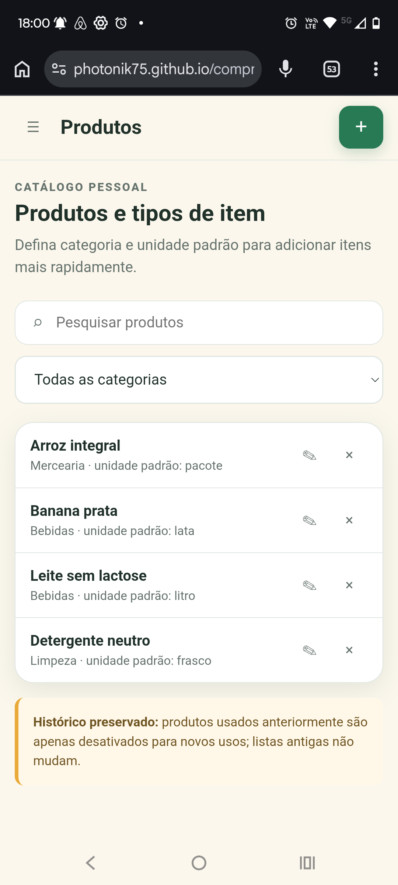
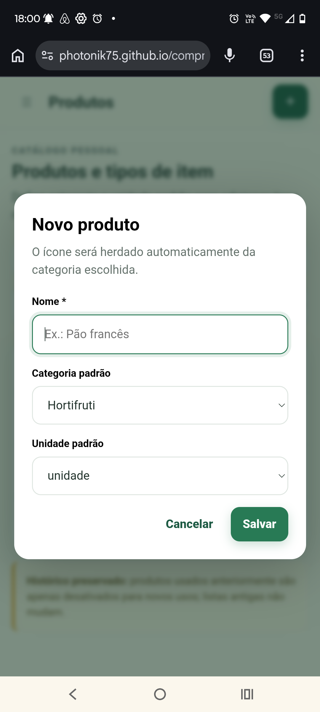
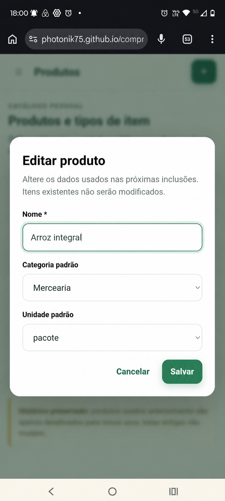
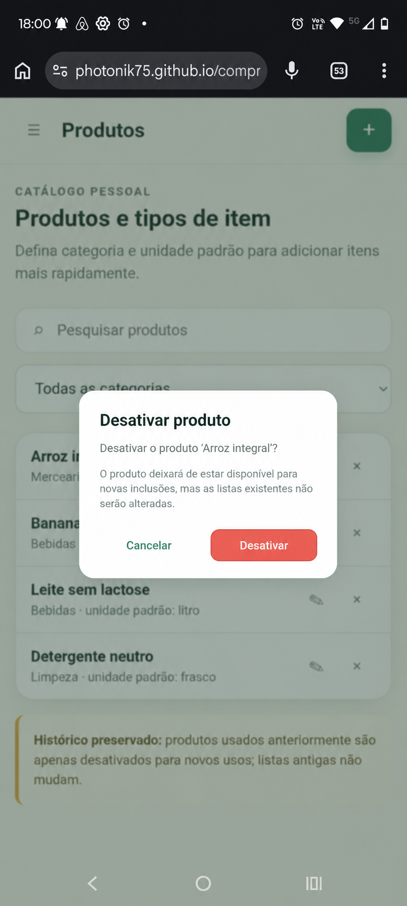
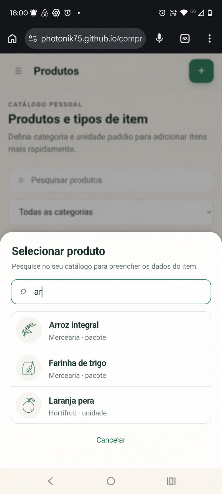

# EF-04 — Catálogo de produtos

## Visão geral

Permitir que cada usuário mantenha um catálogo pessoal de produtos, com categoria e unidade padrão, para
inclusão rápida em listas de compras.

## Imagens

|  |  |  |
|---|---|---|
| **Figura 1:** Tela “Produtos” | **Figura 2:** Diálogo “Novo produto” | **Figura 3:** Diálogo “Editar produto” |

|  |  |
|---|---|
| **Figura 4:** Diálogo “Desativar produto” | **Figura 5:** Seleção de produto |

## Requisitos

- **Tela “Produtos” (Figura 1)**
  - Exibe somente os produtos pertencentes ao usuário autenticado.
  - Exibe inicialmente somente produtos ativos.
  - Ordena os produtos pelo nome conforme o idioma `pt-BR`.
  - Quando dois produtos possuem o mesmo nome para ordenação, mantém uma ordem estável.
  - **Cabeçalho**
    - Exibe o título “Produtos”.
    - **Botão “Novo produto”**
      - Abre o diálogo “Novo produto”.
  - **Campo “Pesquisar produtos”**
    - Pesquisa pelo nome do produto.
    - Considera correspondência parcial e ignora diferenças entre letras maiúsculas, minúsculas e acentos.
    - Aceita até 60 caracteres após a remoção de espaços excedentes.
    - Atua em conjunto com o filtro de categoria e sobre todos os produtos.
    - Quando não encontra resultados, exibe “Nenhum produto encontrado para esta pesquisa.” e a ação
      “Limpar pesquisa”.
  - **Filtro “Categoria”**
    - Exibe “Todas as categorias” e as categorias não excluídas do usuário.
    - Inicia com “Todas as categorias” selecionada.
    - Quando uma categoria é selecionada, exibe somente seus produtos.
    - Atua em conjunto com a pesquisa.
  - **Lista de produtos**
    - Quando o catálogo não possui produtos ativos, exibe
      “Você ainda não possui produtos. Cadastre seu primeiro produto para começar.” e a ação
      “Novo produto”.
    - Quando os filtros não possuem resultados, exibe “Nenhum produto corresponde aos filtros selecionados.”
      e a ação “Limpar filtros”.
    - **Produto**
      - Exibe o ícone herdado da categoria, o nome, a categoria e a unidade padrão.
      - **Ação “Editar”**
        - É exibida somente para produtos ativos.
        - Abre o diálogo “Editar produto” com os dados atuais.
      - **Ação “Desativar”**
        - É exibida somente para produtos ativos.
        - Abre o diálogo “Desativar produto”.
  - **Aviso “Histórico preservado”**
    - Informa que produtos usados anteriormente são desativados para novos usos sem alterar listas
      existentes.

- **Diálogo “Novo produto” (Figura 2)**
  - Cria um produto ativo pertencente ao usuário autenticado.
  - **Campo “Nome”**
    - Obrigatório.
    - Aceita de 1 a 60 caracteres após a remoção de espaços excedentes.
    - Deve ser único entre os produtos ativos do usuário.
    - A verificação de duplicidade ignora caixa, acentos e espaços excedentes.
    - Produtos inativos não impedem a reutilização do nome e permanecem como registros distintos.
    - Quando vazio, exibe “Por favor, informe o nome do produto.”.
    - Quando excede o limite, exibe “O nome do produto deve ter no máximo 60 caracteres.”.
    - Quando já utilizado, exibe “Você já possui um produto ativo com este nome.”.
  - **Campo “Categoria padrão”**
    - Obrigatório.
    - Exibe somente as categorias não excluídas pertencentes ao usuário.
    - Quando não selecionada, exibe “Por favor, escolha uma categoria.”.
    - Quando a categoria deixa de estar disponível antes do salvamento, exibe
      “A categoria selecionada não está mais disponível. Escolha outra categoria.”.
  - **Campo “Unidade padrão”**
    - Obrigatório.
    - Oferece `unidade`, `pacote`, `caixa`, `garrafa`, `frasco`, `lata`, `saco`, `bandeja`, `dúzia`,
      `quilograma`, `grama`, `litro` e `mililitro`.
    - Quando não informada ou inválida, exibe “Por favor, escolha uma unidade disponível.”.
  - **Botão “Salvar”**
    - Valida os campos antes de criar o produto.
    - Enquanto processa a criação, não permite novo envio.
    - Cliques repetidos criam somente um produto.
    - Em caso de sucesso, fecha o diálogo, exibe “Produto criado com sucesso.” e inclui o produto na posição
      correta da lista.
    - Em caso de falha inesperada, mantém o diálogo aberto, preserva os campos e exibe
      “Não foi possível criar o produto. Tente novamente em alguns instantes.”.
  - **Botão “Cancelar”**
    - Fecha o diálogo sem criar o produto.
    - Devolve o foco ao botão “Novo produto”.
  - **Tecla `Esc`**
    - Tem o mesmo comportamento do botão “Cancelar”.

- **Diálogo “Editar produto” (Figura 3)**
  - Permite alterar somente um produto ativo pertencente ao usuário autenticado.
  - Exibe o nome, a categoria e a unidade padrão atuais.
  - **Campo “Nome”**
    - Aplica as mesmas regras e mensagens do campo “Nome” do diálogo “Novo produto”.
    - Ignora o próprio produto ao verificar duplicidade.
  - **Campo “Categoria padrão”**
    - Aplica as mesmas regras e mensagens do campo “Categoria padrão” do diálogo “Novo produto”.
  - **Campo “Unidade padrão”**
    - Aplica as mesmas regras e mensagens do campo “Unidade padrão” do diálogo “Novo produto”.
  - **Botão “Salvar”**
    - Salva somente quando nome, categoria ou unidade padrão foi alterado.
    - Enquanto processa a alteração, não permite novo envio.
    - Em caso de sucesso, fecha o diálogo, exibe “Produto atualizado com sucesso.” e atualiza a lista.
    - Aplica os novos dados somente às futuras inclusões do produto em listas.
    - Preserva o nome, a categoria, o ícone e a unidade registrados nos itens já incluídos em listas.
    - Quando o produto foi alterado após a abertura do diálogo, não sobrescreve os dados mais recentes e
      exibe “Este produto foi alterado em outro lugar. Recarregue os dados para continuar.”.
    - Oferece a ação “Recarregar dados” após um conflito.
    - Em caso de falha inesperada, mantém o diálogo aberto, preserva os campos e exibe
      “Não foi possível atualizar o produto. Tente novamente em alguns instantes.”.
  - **Botão “Cancelar”**
    - Fecha o diálogo sem persistir alterações.
    - Devolve o foco à ação “Editar” que abriu o diálogo.
  - **Tecla `Esc`**
    - Tem o mesmo comportamento do botão “Cancelar”.

- **Diálogo “Desativar produto” (Figura 4)**
  - Exibe “Desativar o produto ‘{nome}’?”.
  - Informa que o produto deixará de estar disponível para novas inclusões, mas não alterará listas
    existentes.
  - **Botão “Desativar”**
    - Marca o produto como inativo sem excluí-lo fisicamente.
    - Remove o produto da listagem de ativos e das seleções para novos itens.
    - Preserva os itens de listas que já utilizam o produto.
    - Repetir a desativação de um produto já inativo produz sucesso sem nova alteração.
    - Em caso de sucesso, fecha o diálogo e exibe “Produto desativado com sucesso.”.
    - Em caso de falha inesperada, preserva o produto e exibe
      “Não foi possível desativar o produto. Tente novamente em alguns instantes.”.
  - **Botão “Cancelar”**
    - Fecha o diálogo sem desativar o produto.
    - Devolve o foco à ação “Desativar” que abriu o diálogo.
  - **Tecla `Esc`**
    - Tem o mesmo comportamento do botão “Cancelar”.

- **Componente “Seleção de produto” (Figura 5)**
  - Exibe somente produtos ativos pertencentes ao usuário autenticado.
  - Cada opção contém identificador, nome, categoria, ícone e unidade padrão.
  - Ordena primeiro por correspondência exata, depois por início do nome e, por fim, por ocorrência no nome.
  - Limita o resultado a dez produtos.
  - Nunca exibe produtos ou categorias pertencentes a outro usuário.

## Requisitos não funcionais

- O frontend deve encapsular a comunicação HTTP em serviços; componentes, diretivas e pipes não acessam o
  servidor diretamente.
- O backend deve separar Controllers, Services e Repositories em pacotes da funcionalidade de produtos.
- Criações devem ser idempotentes e alterações concorrentes devem usar controle otimista por versão.
- Criação, edição e desativação devem preservar atomicamente a integridade do catálogo e dos itens históricos.
- A tela “Produtos” deve usar a rota `/produtos`, protegida por sessão.
- Controles, diálogos, mensagens e foco devem ser operáveis por teclado e tecnologias assistivas.

## Contrato de API

Todos os endpoints exigem sessão autenticada. As mutações exigem proteção CSRF. O produto é sempre
associado ao usuário autenticado; requests não aceitam `userId`, `icon` ou `active`. O ícone é derivado da
categoria e a desativação ocorre somente por `DELETE`.

### Endpoints

| Método e rota | Propósito | Entrada | Sucesso |
|---|---|---|---|
| `GET /api/v1/products` | Listar, pesquisar, filtrar e selecionar produtos | Query `search`, `categoryId`, `status`, `cursor`, `limit` | `200 ProductCollection` |
| `POST /api/v1/products` | Criar produto | `ProductInput` e `Idempotency-Key` | `201 Product`, `Location` e `ETag` |
| `GET /api/v1/products/{productId}` | Consultar produto | Path `productId: uuid` | `200 Product` e `ETag` |
| `PATCH /api/v1/products/{productId}` | Editar produto ativo | `ProductPatch` e `If-Match` | `200 Product` e novo `ETag` |
| `DELETE /api/v1/products/{productId}` | Desativar produto | Path `productId: uuid` e `If-Match` | `204` |

### Schemas

| Schemas | Campos e Regras |
|---|---|
| `ProductInput` | `name: string`, `categoryId: uuid` e `defaultUnit: ProductUnit`; todos obrigatórios e não nulos |
| `ProductPatch` | `name`, `categoryId` e `defaultUnit` opcionais e não nulos; deve conter ao menos uma alteração |
| `ProductUnit` | Um de `UNIT`, `PACKAGE`, `BOX`, `BOTTLE`, `FLASK`, `CAN`, `BAG`, `TRAY`, `DOZEN`, `KILOGRAM`, `GRAM`, `LITER` ou `MILLILITER` |
| `CategoryReference` | `id: uuid`, `name: string`, `icon: string` e `available: boolean`; todos obrigatórios |
| `Product` | `id: uuid`, `name: string`, `category: CategoryReference`, `defaultUnit: ProductUnit`, `active: boolean`, `createdAt: date-time`, `updatedAt: date-time` e `version: integer` |
| `ProductCollection` | `items: Product[]` e `page: PageInfo` |
| `PageInfo` | `nextCursor: string \| null` e `hasMore: boolean` |

`name` aceita de 1 a 60 caracteres após normalização. Datas usam UTC. `version` é um inteiro usado para
gerar o `ETag`.

Na consulta, `search` é opcional, aceita até 60 caracteres e ignora caixa e acentos. `categoryId` aceita
somente uma categoria pertencente ao usuário. `status` aceita `ACTIVE`, usado por padrão, `INACTIVE` ou
`ALL`. A coleção é ordenada por nome conforme o idioma `pt-BR` e por `id` crescente para desempate.

Quando `search` estiver presente, a ordenação prioriza correspondência exata, início do nome e ocorrência no
nome. A seleção para novos itens usa `status=ACTIVE` e `limit=10`. O cursor incorpora os filtros e a ordenação
e não pode ser reutilizado com parâmetros diferentes.

Para produto ativo, `category` reflete os dados atuais e possui `available=true`. Quando uma categoria é
excluída depois da desativação de seus produtos, os produtos inativos preservam a última referência conhecida
com `available=false`.

`DELETE` define `active=false` e incrementa `version`. Se o produto já estiver inativo, retorna `204` sem nova
alteração. Enquanto estiver ativo, um `If-Match` desatualizado retorna conflito. Itens existentes não são
alterados.

### Erros

| Situação | Status e código |
|---|---|
| Dados inválidos | `400 VALIDATION_ERROR` com `fieldErrors` contendo as mensagens definidas nos requisitos |
| Nome ativo já utilizado pelo usuário | `409 PRODUCT_NAME_ALREADY_IN_USE` |
| Categoria inexistente ou pertencente a outro usuário | `404 NOT_FOUND` |
| Categoria conhecida, mas excluída | `409 CATEGORY_UNAVAILABLE` |
| Produto inexistente ou pertencente a outro usuário | `404 NOT_FOUND` |
| Produto inativo em operação de edição | `409 PRODUCT_INACTIVE` |
| Versão desatualizada | `409 CONFLICT` com o `ETag` atual |
| Reutilização incompatível da chave idempotente | `409 IDEMPOTENCY_KEY_REUSED` |

## Testes de validação

| ID | Pri. | Preparação | Ação | Resultado |
|---|---:|---|---|---|
| `PROD-001` | P0 | Categoria “Padaria” disponível | Criar “Pão francês” com unidade `unidade` e envio repetido | Um produto criado na posição alfabética, com categoria, unidade e ícone corretos |
| `PROD-002` | P0 | Produto ativo “Arroz” e categorias de dois usuários | Enviar nome vazio, longo ou duplicado, categoria indisponível ou alheia e unidade inválida | Mensagem normativa, diálogo preservado e nenhuma alteração |
| `PROD-003` | P1 | Produtos acentuados distribuídos em categorias | Pesquisar sem acento e alternar categoria | Pesquisa ignora caixa e acentos e atua junto com o filtro |
| `PROD-004` | P0 | Produto ativo já utilizado em uma lista | Editar nome, categoria e unidade e depois criar outro item | Item anterior preservado; catálogo e novo item usam os novos valores |
| `PROD-005` | P0 | Produto ativo utilizado em uma lista | Confirmar desativação, consultar seleções e repetir a operação | Produto ausente dos ativos e das seleções, histórico íntegro e repetição idempotente |
| `PROD-006` | P1 | Produto “Café” inativo | Criar produto ativo “cafe” | Novo identificador, registro anterior inativo e listas existentes preservadas |
| `PROD-007` | P1 | Produto ativo associado a uma categoria | Alterar somente o ícone da categoria e reabrir “Produtos” | Produto mostra o novo ícone e itens existentes permanecem inalterados |
| `PROD-008` | P0 | Produto aberto em dois contextos | Salvar alterações no primeiro e depois no segundo | Conflito informado, primeira alteração preservada e ação para recarregar |
| `PROD-009` | P0 | Produto de um usuário e sessão de outro | Consultar, editar e desativar o identificador alheio | Todas as operações respondem `NOT_FOUND` e nada é alterado |
| `PROD-010` | P1 | Diálogos de criação, edição e desativação abertos | Cancelar e fechar com `Esc` | Nenhuma alteração e foco devolvido ao acionador |
