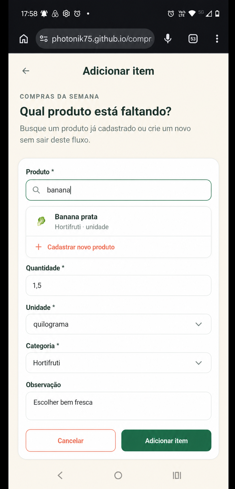
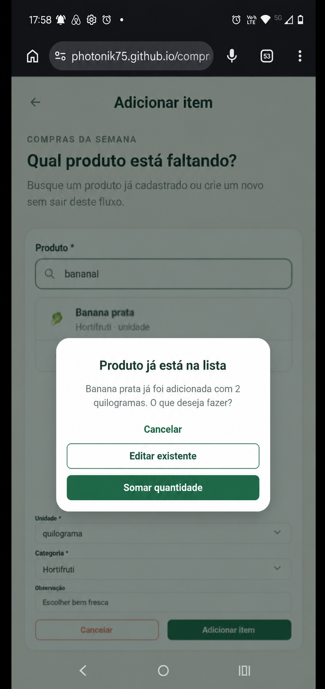
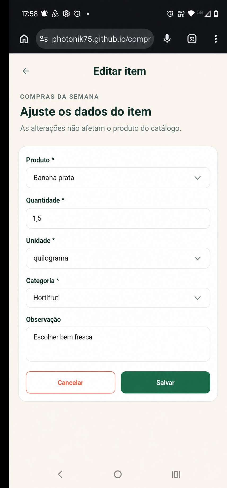
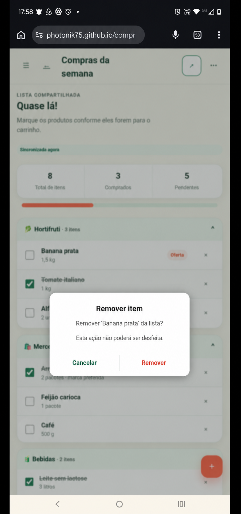

# EF-05 — Gestão de itens da lista

## Visão geral

Acrescentar à tela de detalhe da lista a administração de itens, permitindo que proprietários e participantes
adicionem, editem e removam itens de uma lista ativa, com preservação dos dados históricos dos produtos.

## Imagens

|  |  |  |
|---|---|---|
| **Figura 1:** Tela “Detalhe da lista” — gestão de itens | **Figura 2:** Tela “Adicionar item” | **Figura 3:** Diálogo “Produto já está na lista” |

|  |  |
|---|---|
| **Figura 4:** Tela “Editar item” | **Figura 5:** Diálogo “Remover item” |

## Requisitos

- **Tela “Detalhe da lista” (Figura 1)**
  - Neste incremento, abrange somente a apresentação, inclusão, edição e remoção de itens.
  - Permite administrar itens somente quando a lista está ativa e o usuário é proprietário ou participante.
  - Lista concluída permanece disponível somente para consulta.
  - Agrupa itens pelo nome normalizado da categoria registrado no item.
  - Ordena grupos por categoria e itens por produto conforme o idioma `pt-BR`.
  - Categorias homônimas de catálogos diferentes formam um único grupo.
  - **Grupo de categoria**
    - Exibe o ícone, o nome da categoria e a quantidade de itens.
    - **Item**
      - Exibe nome, quantidade, unidade e observação, quando houver.
      - Usa o nome, a categoria e o ícone registrados na inclusão ou na última edição.
      - Mudanças posteriores no catálogo não alteram o item.
      - **Ação “Editar”**
        - Abre a tela “Editar item”.
      - **Ação “Remover”**
        - Abre o diálogo “Remover item”.
  - **Ação “Adicionar item”**
    - Abre a tela “Adicionar item”.

- **Tela “Adicionar item” (Figura 2)**
  - Cria um item desmarcado na lista ativa.
  - **Campo “Produto”**
    - Obrigatório e exige a seleção de um produto válido.
    - A partir do primeiro caractere, sugere até dez produtos ativos do catálogo do usuário.
    - A pesquisa ignora caixa e acentos e ordena por correspondência exata, início do nome, ocorrência e nome.
    - Não exibe produtos inativos ou pertencentes a outro usuário.
    - Ao selecionar, preenche categoria e unidade com os padrões do produto.
    - Quando há somente texto digitado, exibe “Selecione um produto válido na lista de sugestões.”.
    - **Ação “Cadastrar novo produto”**
      - Abre o cadastro de produto.
      - Ao retornar de um cadastro bem-sucedido, preserva os demais campos e seleciona o novo produto.
  - **Campo “Quantidade”**
    - Obrigatório.
    - Aceita decimal maior que zero e menor ou igual a `999999,99`.
    - Exibe vírgula decimal e omite zeros desnecessários.
    - Quando vazio ou inválido, exibe “Informe uma quantidade maior que zero.”.
    - Quando excede o limite, exibe “A quantidade deve ser menor ou igual a 999999,99.”.
  - **Campo “Unidade”**
    - Obrigatório.
    - Oferece `unidade`, `pacote`, `caixa`, `garrafa`, `frasco`, `lata`, `saco`, `bandeja`, `dúzia`,
      `quilograma`, `grama`, `litro` e `mililitro`.
    - Permite alterar o valor preenchido pelo produto.
    - Quando inválido, exibe “Escolha uma unidade disponível.”.
  - **Campo “Categoria”**
    - Obrigatório.
    - Exibe somente categorias não excluídas do usuário.
    - Permite alterar o valor preenchido pelo produto.
    - Quando indisponível, exibe “A categoria selecionada não está mais disponível. Escolha outra.”.
  - **Campo “Observação”**
    - Opcional e aceita até 240 caracteres.
    - Quando excede o limite, exibe “A observação deve ter no máximo 240 caracteres.”.
  - **Botão “Adicionar item”**
    - Valida todos os campos antes de salvar.
    - Enquanto processa, não permite novo envio.
    - Registra nome, categoria e ícone como dados históricos do item.
    - Em sucesso, volta ao detalhe e destaca temporariamente o novo item.
    - Quando encontra produto homônimo na lista, abre o diálogo “Produto já está na lista”.
    - Em falha inesperada, preserva o formulário e exibe
      “Não foi possível adicionar o item. Tente novamente em alguns instantes.”.
  - **Ação “Cancelar”**
    - Volta ao detalhe sem criar item.

- **Diálogo “Produto já está na lista” (Figura 3)**
  - É exibido quando outro item não excluído possui o mesmo nome normalizado do produto selecionado.
  - Identifica o produto, a quantidade e a unidade do item existente.
  - **Botão “Cancelar”**
    - Fecha o diálogo, mantém o formulário e não altera itens.
  - **Botão “Editar existente”**
    - Não cria item e abre o item existente na tela “Editar item”.
  - **Botão “Somar quantidade”**
    - É habilitado somente quando as unidades são iguais.
    - Soma as quantidades atomicamente sem criar outro item.
    - Preserva unidade, categoria e observação do item existente.
    - Quando a soma excede o limite, exibe “A quantidade total deve ser menor ou igual a 999999,99.”.
    - Para unidades diferentes, fica desabilitado e exibe
      “As unidades são diferentes. Edite o item existente para continuar.”.

- **Tela “Editar item” (Figura 4)**
  - Exibe os valores atuais do item.
  - Aplica aos campos as mesmas regras e mensagens da tela “Adicionar item”.
  - Permite alterar produto, quantidade, unidade, categoria e observação.
  - Preserva o estado comprado, o autor e o horário da marcação.
  - **Botão “Salvar”**
    - Salva somente quando há alteração.
    - Quando a troca de produto causa duplicidade, abre o diálogo “Produto já está na lista”.
    - Ao somar com outro item, atualiza o destino e remove logicamente o item editado na mesma operação.
    - Quando outra alteração foi salva antes, não sobrescreve os dados e exibe
      “Este item foi alterado por outra pessoa. Recarregue os dados para continuar.”.
    - Em sucesso, volta ao detalhe e exibe “Item atualizado com sucesso.”.
    - Em falha inesperada, preserva o formulário e exibe
      “Não foi possível atualizar o item. Tente novamente em alguns instantes.”.
  - **Ação “Cancelar”**
    - Volta ao detalhe sem persistir alterações.

- **Diálogo “Remover item” (Figura 5)**
  - Exibe “Remover ‘{produto}’ da lista?”.
  - Informa que a remoção não poderá ser desfeita.
  - **Botão “Remover”**
    - Exclui logicamente o item, atualiza o resumo e fecha o diálogo.
    - Repetir a mesma remoção produz sucesso sem nova alteração.
    - Em falha, preserva o item e exibe
      “Não foi possível remover o item. Tente novamente em alguns instantes.”.
  - **Botão “Cancelar”**
    - Fecha o diálogo sem remover o item.

## Contrato de API

Todos os endpoints exigem sessão e acesso como proprietário ou participante. Mutações exigem CSRF e lista
ativa.

### Endpoints

| Método e rota | Propósito | Entrada | Sucesso |
|---|---|---|---|
| `GET /api/v1/lists/{listId}/items` | Listar itens | Query `cursor`, `limit` | `200 ListItemCollection` |
| `POST /api/v1/lists/{listId}/items` | Criar ou somar item | `CreateItemRequest` e `Idempotency-Key` | `201` criado ou `200` somado, com `ItemMutationResult` |
| `GET /api/v1/lists/{listId}/items/{itemId}` | Consultar item | Path `listId`, `itemId` | `200 ListItem` e `ETag` |
| `PATCH /api/v1/lists/{listId}/items/{itemId}` | Editar ou mesclar item | `UpdateItemRequest`, `If-Match` e `Idempotency-Key` | `200 ItemMutationResult` e `ETag` |
| `DELETE /api/v1/lists/{listId}/items/{itemId}` | Remover item | `If-Match` e `Idempotency-Key` | `200 ItemDeletionResult` |

### Schemas

| Schemas | Campos e Regras |
|---|---|
| `CreateItemRequest` | `productId: uuid`, `quantity: decimal string`, `unit: ProductUnit` e `categoryId: uuid` obrigatórios; `notes` opcional; resolução de duplicidade opcional |
| `UpdateItemRequest` | Mesmos campos funcionais, opcionais; ao menos uma mudança; pode informar resolução e versão do item de destino |
| `ProductSnapshot` | `id: uuid` e `name: string` registrados no item |
| `CategorySnapshot` | `id: uuid`, `name: string` e `icon: string` registrados no item |
| `ListItem` | Identificadores, snapshots, quantidade, unidade, observação, marcação, autoria, datas e versão |
| `ListItemCollection` | `items: ListItem[]`, `page: PageInfo`, `listSummary: ListSummary` e `listVersion: integer` |
| `ItemMutationResult` | `outcome: CREATED \| UPDATED \| MERGED`, `item`, `removedItemId`, `listSummary` e `listVersion` |
| `ItemDeletionResult` | `deletedItemId`, `listSummary` e `listVersion` |
| `ListSummary` | `total`, `checked`, `pending` e `percentage`, inteiros obrigatórios e não negativos |

O servidor deriva os snapshots, a marcação, a autoria e as datas. O cliente não pode enviá-los. Toda mutação
incrementa a versão da lista uma vez, inclusive a mesclagem atômica.

Sem resolução, duplicidade retorna `409 DUPLICATE_ITEM`, com item existente, quantidade, unidade, versão e
`canMerge`. Unidades diferentes retornam `409 INCOMPATIBLE_UNITS`; soma acima do limite retorna
`400 QUANTITY_LIMIT_EXCEEDED`. Lista concluída retorna `409 LIST_COMPLETED`; versão antiga,
`409 CONFLICT`; recurso inacessível, `404 NOT_FOUND`.

## Testes de validação

| ID | Pri. | Preparação | Ação | Resultado |
|---|---:|---|---|---|
| `ITEM-001` | P0 | Lista ativa e produto válido | Selecionar produto, preencher e adicionar | Item desmarcado com padrões e snapshots corretos, persistente após recarga |
| `ITEM-002` | P0 | Formulário aberto | Digitar produto sem selecionar | Mensagem normativa, demais campos preservados e nenhum item |
| `ITEM-003` | P0 | Produto selecionado | Enviar quantidades e enumerações inválidas | Cada entrada recusada sem alteração parcial |
| `ITEM-004` | P1 | Catálogos com produtos ativos, inativos e alheios | Pesquisar variações | Até dez sugestões próprias e ativas na ordem definida |
| `ITEM-005` | P0 | Item homônimo existente | Cancelar, editar existente e somar em cenários separados | Cada opção produz somente o efeito especificado |
| `ITEM-006` | P0 | Duplicata com unidades diferentes | Abrir resolução e tentar somar diretamente | Soma indisponível e recusada, com orientação polida |
| `ITEM-007` | P0 | Item marcado | Editar campos | Dados alterados e marcação integralmente preservada |
| `ITEM-008` | P0 | Dois itens distintos | Trocar produto e somar ao duplicado | Um item restante, soma atômica e nenhuma situação intermediária |
| `ITEM-009` | P0 | Lista com itens | Cancelar remoção, confirmar e repetir | Uma remoção, resumo correto e repetição idempotente |
| `ITEM-010` | P0 | Participante, lista concluída e usuário alheio | Tentar mutações | Participante altera lista ativa; demais casos recusados sem mudanças |
| `ITEM-011` | P0 | Participantes com produtos homônimos distintos | Adicionar segundo produto | Duplicidade detectada pelo nome normalizado |
| `ITEM-012` | P0 | Item aberto em dois contextos | Salvar alterações concorrentes | Segunda alteração recusada, primeira preservada e opção de recarga |
