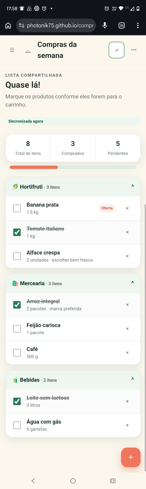
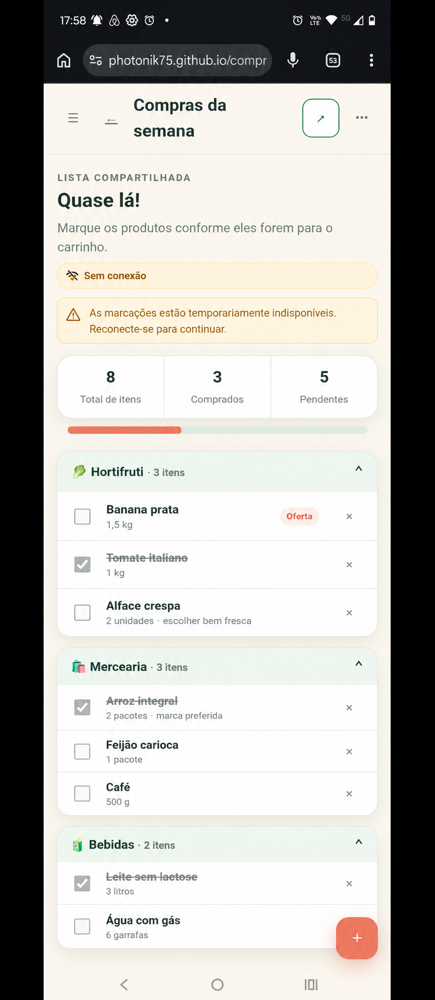
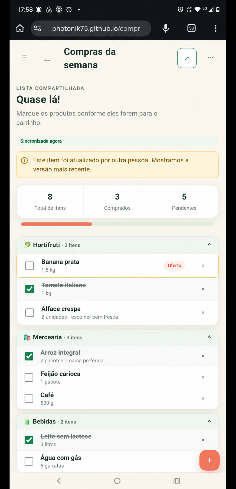

# EF-06 — Execução da compra

## Visão geral

Acrescentar à tela de detalhe da lista a execução colaborativa da compra, permitindo marcar itens e
acompanhar o progresso sincronizado entre proprietários e participantes.

## Imagens

|  |  |  |
|---|---|---|
| **Figura 1:** Tela “Detalhe da lista” — execução da compra | **Figura 2:** Tela “Detalhe da lista” sem conexão | **Figura 3:** Aviso de atualização concorrente |

## Requisitos

- **Tela “Detalhe da lista” — execução da compra (Figuras 1 e 2)**
  - Amplia a tela com marcação, resumo, progresso e sincronização colaborativa.
  - Exibe nome, indicação de compartilhamento, estado de sincronização, resumo e progresso da lista.
  - Permite marcações somente em lista ativa para proprietário ou participante.
  - **Resumo**
    - Considera somente itens não excluídos.
    - `Total` corresponde à quantidade de linhas, independentemente da quantidade de cada item.
    - `Comprados` corresponde às linhas marcadas.
    - `Pendentes` corresponde ao total menos os comprados.
    - `Percentual` corresponde ao arredondamento de comprados dividido pelo total.
    - Para lista vazia, exibe zero em todos os valores e percentual zero.
  - **Barra de progresso**
    - Representa o percentual do resumo.
  - **Estado de sincronização**
    - Exibe “Sincronizando…”, “Sincronizada às {horário}”, “Sem conexão” ou
      “Falha na sincronização. Tente novamente.”.
    - Ao voltar do segundo plano ou reconectar, atualiza a lista antes de permitir novas marcações.
  - **Grupo de categoria**
    - Exibe ícone, nome e quantidade de itens.
    - Permite expandir e recolher localmente sem alterar dados ou outros usuários.
    - **Item**
      - Exibe nome, quantidade, unidade, observação como texto e estado comprado.
      - **Controle de marcação**
        - Ao marcar, registra o estado comprado, o usuário e o horário atuais.
        - Ao desmarcar, limpa o usuário e o horário da marcação.
        - Atualiza o item, o resumo e o progresso somente com o estado confirmado pelo servidor.
        - Enquanto processa, impede cliques repetidos.
        - Repetir o estado atual produz sucesso sem alterar versão, autor ou horário.
        - Em falha, restaura o último estado confirmado e exibe
          “Não foi possível atualizar o item. Verifique sua conexão e tente novamente.”.
        - Sem conexão, não apresenta uma marcação como sincronizada.
  - **Estado vazio**
    - Exibe resumo zerado e “Sua lista ainda está vazia.”.
    - Para lista ativa, oferece a ação “Adicionar primeiro item”.
  - **Modo somente leitura**
    - Para lista concluída, exibe os dados e oculta ou desabilita os controles de marcação.
    - Para usuário sem acesso, não revela a lista e exibe “Lista não encontrada ou indisponível.”.

- **Aviso “Atualização concorrente” (Figura 3)**
  - É exibido quando outra pessoa atualiza o mesmo item antes da confirmação local.
  - Adota imediatamente o estado atual retornado pelo servidor.
  - Exibe “Este item foi atualizado por outra pessoa. Mostramos a versão mais recente.”.
  - Não sobrescreve silenciosamente a alteração confirmada.

- **Atualização colaborativa da tela “Detalhe da lista” (Figura 1)**
  - Apresenta alterações confirmadas de itens, lista e acesso em até cinco segundos.
  - Ao perder um evento, refaz a leitura completa.
  - Ao perder acesso ou quando a lista é excluída, volta ao painel e exibe
    “Seu acesso a esta lista não está mais disponível.”.
  - O servidor permanece como fonte dos dados após reconexões.

## Contrato de API

A carga inicial consulta o detalhe da lista e todas as páginas de itens. A marcação exige sessão, CSRF,
acesso como proprietário ou participante, lista ativa e versão atual do item.

### Endpoints

| Método e rota | Propósito | Entrada | Sucesso |
|---|---|---|---|
| `PUT /api/v1/lists/{listId}/items/{itemId}/checked` | Marcar ou desmarcar item | `CheckItemRequest` e `If-Match` | `200 CheckItemResult` e novo `ETag` |
| `GET /api/v1/lists/{listId}/events` | Receber atualizações da lista | `Accept: text/event-stream` e `Last-Event-ID` opcional | Stream SSE |

### Schemas

| Schemas | Campos e Regras |
|---|---|
| `CheckItemRequest` | `checked: boolean`, único campo aceito |
| `UserReference` | `id: uuid` e `name: string` |
| `ListItem` | Item completo, incluindo `checked`, `checkedAt`, `checkedBy` e `version` |
| `ListSummary` | `total`, `checked`, `pending` e `percentage`, inteiros não negativos; percentual de 0 a 100 |
| `CheckItemResult` | `item: ListItem`, `listSummary: ListSummary` e `listVersion: integer` |
| `ListEvent` | `listId`, `listVersion`, `resourceId`, `actor`, `occurredAt`, `type` e `payload` discriminado |

O stream exige sessão, usa `text/event-stream`, `Cache-Control: no-cache`, identificadores opacos e heartbeat
em até 20 segundos. Aceita retomada por `Last-Event-ID`. Se o histórico não estiver disponível, envia
`resync.required` e encerra a conexão.

Tipos de evento: `list.updated`, `list.status.changed`, `list.deleted`, `list.item.created`,
`list.item.updated`, `list.item.deleted`, `list.item.checked`, `list.access.changed` e `resync.required`.
Eventos não incluem tokens, e-mails desnecessários ou dados privados de catálogo.

Estado solicitado já confirmado retorna `200` sem alterar versão, autor ou horário. Item removido ou sem
acesso retorna `404 NOT_FOUND`; lista concluída, `409 LIST_COMPLETED`; versão divergente, `409 CONFLICT` com
estado atual; falha transitória, `503 SERVICE_UNAVAILABLE`.

## Testes de validação

| ID | Pri. | Preparação | Ação | Resultado |
|---|---:|---|---|---|
| `SHOP-001` | P0 | Oito itens, três marcados e quantidades variadas | Abrir lista | Total 8, comprados 3, pendentes 5 e percentual 38 |
| `SHOP-002` | P0 | Item pendente | Marcar, recarregar, desmarcar e recarregar | Estados e resumo persistem; autoria é registrada e depois limpa |
| `SHOP-003` | P1 | Item marcado com autoria conhecida | Repetir `checked=true` | Sucesso sem mudar autoria, horário, versão ou resumo |
| `SHOP-004` | P0 | Lista vazia | Abrir | Zeros válidos e ação para adicionar item |
| `SHOP-005` | P1 | Categorias distintas e homônimas | Recolher grupo em um contexto | Agrupamento correto e preferência somente local |
| `SHOP-006` | P0 | Proprietário e participante conectados | Um marca e outro adiciona item | Alterações aparecem no outro contexto em até cinco segundos |
| `SHOP-007` | P0 | Dois contextos com a mesma versão | Enviar estados diferentes | Uma confirmação, um conflito e convergência ao servidor |
| `SHOP-008` | P0 | Mutação configurada para falhar | Marcar item | Processamento visível, clique único, reversão e mensagem polida |
| `SHOP-009` | P0 | Contexto desconectado enquanto outro altera | Reconectar e marcar | Ressincronização anterior à escrita e resumo convergente |
| `SHOP-010` | P0 | Lista concluída e usuário alheio | Tentar marcar pela interface e diretamente | Controles indisponíveis e nenhuma alteração |
| `SHOP-011` | P1 | Dois contextos e estado conhecido | Adicionar, remover e marcar simultaneamente | Resumo final corresponde exatamente aos itens persistidos |
