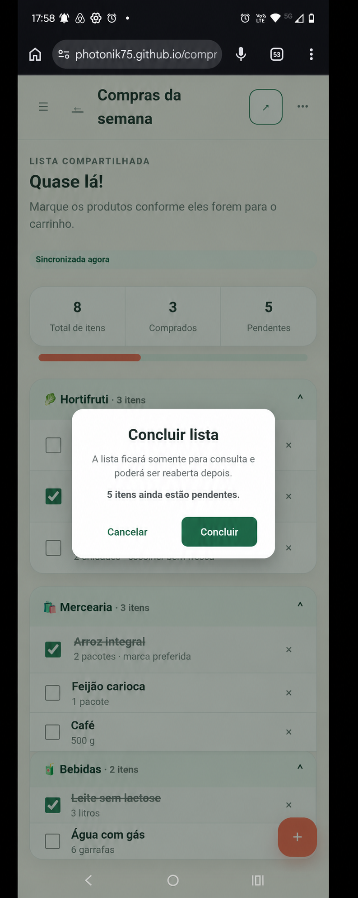
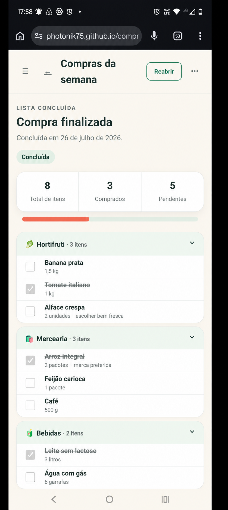
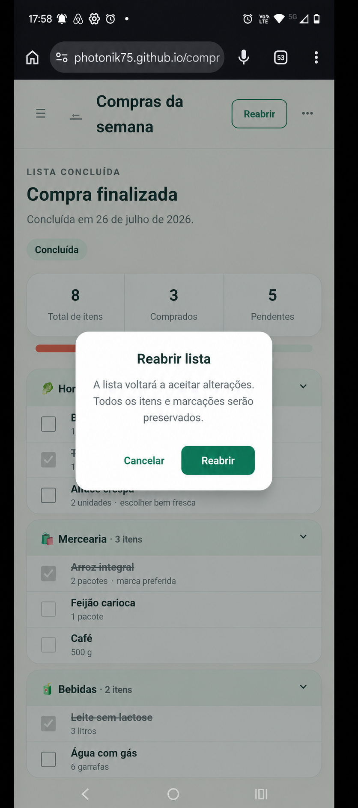
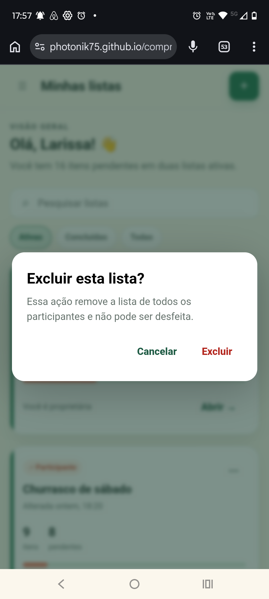

# EF-07 — Ciclo de vida da lista

## Visão geral

Permitir que o proprietário conclua, reabra e exclua uma lista, preservando sua consulta histórica enquanto
ela não for excluída.

## Imagens

|  |  |  |
|---|---|---|
| **Figura 1:** Diálogo “Concluir lista” | **Figura 2:** Tela “Lista concluída” | **Figura 3:** Diálogo “Reabrir lista” |

|  |
|---|
| **Figura 4:** Diálogo “Excluir lista” |

## Requisitos

- **Diálogo “Concluir lista” (Figura 1)**
  - É acessível somente ao proprietário de uma lista ativa.
  - Informa que a lista ficará somente para consulta e poderá ser reaberta.
  - Exibe a quantidade de itens pendentes.
  - Permite concluir listas vazias, parcialmente compradas ou totalmente compradas.
  - **Botão “Concluir”**
    - Altera o estado para concluída e registra a data atual.
    - Preserva todos os itens, marcações, participantes e convites pendentes.
    - Faz os clientes conectados entrarem em modo somente leitura.
    - Em sucesso, abre a tela “Lista concluída” e exibe “Lista concluída com sucesso.”.
    - Em conflito, não altera o estado e exibe
      “Esta lista foi atualizada em outro lugar. Recarregue os dados para continuar.”.
    - Em falha, exibe “Não foi possível concluir a lista. Tente novamente em alguns instantes.”.
  - **Botão “Cancelar”**
    - Fecha o diálogo sem alterar a lista.

- **Tela “Lista concluída” (Figura 2)**
  - Exibe nome, descrição, data da conclusão, participantes, itens, marcações e resumo final.
  - Exibe a indicação “Concluída”.
  - Permite consulta ao proprietário e aos participantes.
  - Oculta ou desabilita edição de metadados, administração e marcação de itens, convites, remoção de
    participantes, saída e aceite de convite.
  - Tentativas diretas de mutação não alteram dados e exibem
    “Esta lista está concluída e disponível somente para consulta.”.
  - Convites pendentes continuam registrados, mas não podem ser aceitos até a reabertura.
  - **Ação “Reabrir lista”**
    - É exibida somente ao proprietário e abre o diálogo “Reabrir lista”.
  - **Ação “Excluir lista”**
    - É exibida somente ao proprietário e abre o diálogo “Excluir lista”.

- **Diálogo “Reabrir lista” (Figura 3)**
  - É acessível somente ao proprietário de uma lista concluída.
  - Informa que a lista voltará a aceitar alterações.
  - **Botão “Reabrir”**
    - Altera o estado para ativa e remove a data de conclusão.
    - Preserva itens, quantidades, observações, marcações, participantes e convites.
    - Volta a permitir as operações de lista ativa e o aceite de convites válidos.
    - Em sucesso, abre a lista ativa e exibe “Lista reaberta com sucesso.”.
    - Em conflito, não altera o estado e exibe
      “Esta lista foi atualizada em outro lugar. Recarregue os dados para continuar.”.
    - Em falha, exibe “Não foi possível reabrir a lista. Tente novamente em alguns instantes.”.
  - **Botão “Cancelar”**
    - Fecha o diálogo sem alterar a lista.

- **Diálogo “Excluir lista” (Figura 4)**
  - É acessível somente ao proprietário de uma lista ativa ou concluída.
  - Exibe “Excluir a lista ‘{nome}’?”.
  - Informa que todos perderão o acesso e que a lista não poderá ser restaurada.
  - **Botão “Excluir”**
    - Exclui logicamente a lista e revoga participantes e convites na mesma operação.
    - Remove a lista de todos os painéis e invalida seus endereços antigos.
    - Redireciona clientes conectados ao painel.
    - Preserva internamente os dados necessários à integridade histórica, sem permitir acesso normal.
    - Repetir a mesma exclusão autenticada pela mesma operação produz sucesso sem nova alteração.
    - Em sucesso, abre “Minhas listas” e exibe “Lista excluída com sucesso.”.
    - Em conflito, preserva a lista e exibe
      “Esta lista foi atualizada em outro lugar. Recarregue os dados para continuar.”.
    - Em falha, exibe “Não foi possível excluir a lista. Tente novamente em alguns instantes.”.
  - **Botão “Cancelar”**
    - Fecha o diálogo sem excluir a lista.

## Requisitos não funcionais

- O frontend deve encapsular comunicação HTTP e sincronização em serviços; componentes, diretivas e pipes não
  acessam o servidor diretamente.
- O backend deve separar Controllers, Services e Repositories em pacotes da funcionalidade de ciclo de vida.
- Transições e exclusões devem ser idempotentes, usar controle otimista e atualizar dados e eventos
  atomicamente.
- Mudanças de estado ou acesso devem alcançar clientes conectados em até cinco segundos.
- A lista ativa ou concluída deve usar a rota `/listas/{listId}`, protegida por sessão e acesso à lista; os
  diálogos de ciclo de vida não criam rotas próprias.
- Controles, diálogos, mensagens e foco devem ser operáveis por teclado e tecnologias assistivas.

## Contrato de API

Os endpoints exigem sessão, CSRF, papel de proprietário, versão atual e chave idempotente. Datas são
determinadas pelo servidor.

### Endpoints

| Método e rota | Propósito | Entrada | Sucesso |
|---|---|---|---|
| `PUT /api/v1/lists/{listId}/status` | Concluir ou reabrir lista | `ChangeListStatusRequest`, `If-Match` e `Idempotency-Key` | `200 ListDetail` e novo `ETag` |
| `DELETE /api/v1/lists/{listId}` | Excluir lista e revogar acessos | `If-Match` e `Idempotency-Key` | `204` |

### Schemas

| Schemas | Campos e Regras |
|---|---|
| `ChangeListStatusRequest` | `status: ACTIVE \| COMPLETED`, único campo aceito |
| `ListSummary` | `total`, `checked`, `pending` e `percentage` |
| `ListDetail` | Dados da lista, proprietário, papel, resumo, datas, estado e versão |

`COMPLETED` somente é aceito para lista ativa; `ACTIVE`, para lista concluída. O servidor calcula os
pendentes, define `completedAt` ao concluir e o remove ao reabrir. Repetir a chave idempotente devolve o
resultado original sem nova versão ou evento.

Estado desejado já atual retorna `409 INVALID_LIST_TRANSITION`; versão antiga, `409 CONFLICT`; participante,
`403 FORBIDDEN`; lista inexistente, excluída ou inacessível, `404 NOT_FOUND`.

Excluir marca a lista, revoga acessos e convites e publica os eventos de exclusão e acesso na mesma operação.
A repetição com a mesma chave retorna `204`; outra solicitação posterior retorna `404 NOT_FOUND`. Conflitos
não publicam eventos.

## Testes de validação

| ID | Pri. | Preparação | Ação | Resultado |
|---|---:|---|---|---|
| `LIFE-001` | P0 | Lista ativa com itens pendentes | Confirmar conclusão | Quantidade informada, estado concluído, data registrada e modo somente leitura |
| `LIFE-002` | P1 | Lista vazia e lista totalmente comprada | Concluir ambas | Sucesso e resumos preservados |
| `LIFE-003` | P1 | Diálogos de transição abertos | Cancelar e pressionar `Esc` | Estado intacto e foco devolvido ao acionador |
| `LIFE-004` | P0 | Lista concluída com participantes e convite | Tentar todas as mutações | Consulta disponível, mutações recusadas e convite preservado |
| `LIFE-005` | P0 | Lista concluída conhecida | Reabrir | Lista ativa, data removida e conteúdo integralmente preservado |
| `LIFE-006` | P0 | Participante de listas ativa e concluída | Invocar ações de ciclo de vida | Ações ausentes e chamadas recusadas |
| `LIFE-007` | P0 | Lista com participante, convite e contextos abertos | Excluir | Todos perdem acesso, painéis são atualizados e endereços retornam `NOT_FOUND` |
| `LIFE-008` | P1 | Duas requisições equivalentes de exclusão | Enviar em sequência | Uma exclusão lógica e repetição idempotente |
| `LIFE-009` | P0 | Mesma versão em dois contextos | Fazer transições concorrentes | Segunda operação em conflito e nenhum estado intermediário |
| `LIFE-010` | P1 | Lista concluída com histórico conhecido | Consultar e recarregar | Data, pessoas, itens e resumo final sem controles mutáveis |
