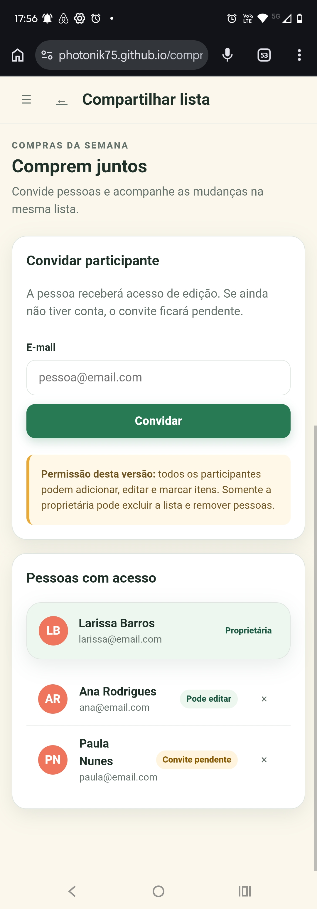
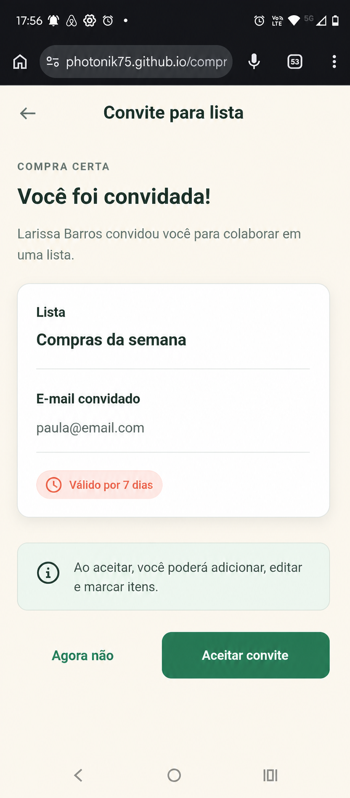
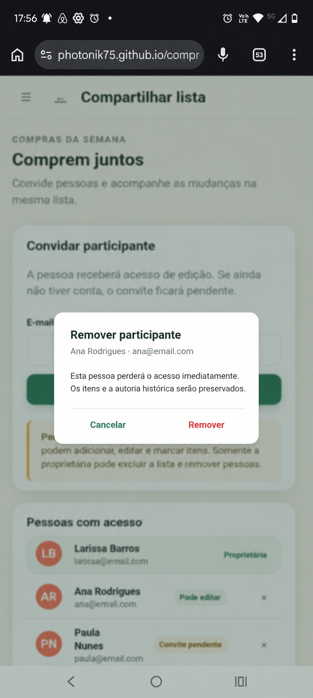
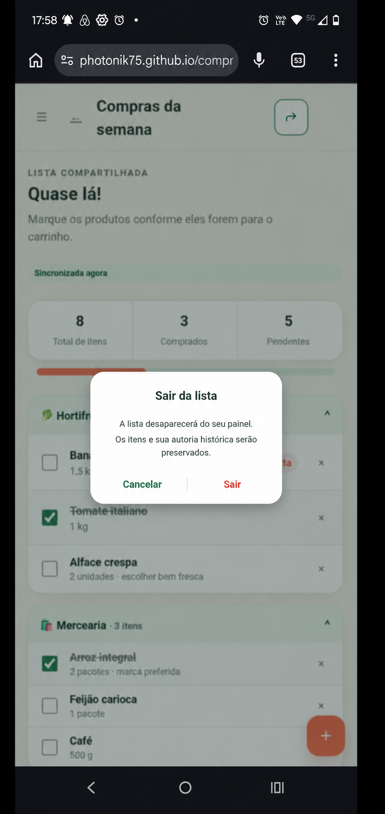

# EF-08 — Compartilhamento e colaboração

## Visão geral

Permitir que o proprietário compartilhe uma lista ativa por e-mail e que participantes colaborem nos itens
com acesso consistente e atualização em até cinco segundos.

## Imagens

|  |  |  |
|---|---|---|
| **Figura 1:** Tela “Compartilhar lista” | **Figura 2:** Tela “Aceitar convite” | **Figura 3:** Diálogo “Remover participante” |

|  |
|---|
| **Figura 4:** Diálogo “Sair da lista” |

## Requisitos

- **Tela “Compartilhar lista” (Figura 1)**
  - É acessível ao proprietário e aos participantes atuais.
  - Exibe proprietário, participantes ativos e convites pendentes ou expirados administráveis.
  - Ordena primeiro o proprietário, depois participantes por nome e convites por e-mail.
  - Exibe nome e e-mail somente a usuários com acesso atual.
  - Participante visualiza as pessoas, mas não os controles administrativos.
  - Lista concluída permanece consultável, sem ações de administração ou saída.
  - **Formulário “Convidar participante”**
    - É exibido somente ao proprietário de lista ativa.
    - **Campo “E-mail”**
      - Obrigatório, válido e normalizado para minúsculas.
      - Quando inválido, exibe “Por favor, informe um e-mail válido.”.
      - Não aceita o proprietário e exibe “Você já é o proprietário desta lista.”.
      - Não aceita participante ativo e exibe “Esta pessoa já participa da lista.”.
      - Não aceita convite pendente e exibe “Já existe um convite pendente para este e-mail.”.
    - **Botão “Convidar”**
      - Enquanto processa, não permite novo envio.
      - Para conta ativa, concede acesso de participante imediatamente e envia um aviso.
      - Para e-mail sem conta, cria convite pendente válido por sete dias e envia link de uso único.
      - Persiste o convite antes do envio.
      - Em sucesso, exibe “Convite enviado com sucesso.” ou “Participante adicionado com sucesso.”.
      - Em falha definitiva do envio, mantém o convite pendente, exibe “Falha no envio” e oferece “Reenviar”.
      - Em falha inesperada, exibe “Não foi possível compartilhar a lista. Tente novamente mais tarde.”.
  - **Relação “Pessoas com acesso”**
    - **Proprietário**
      - Exibe nome, e-mail e o papel “Proprietário”.
      - Não oferece remoção ou saída.
    - **Participante**
      - Exibe nome, e-mail e o papel “Participante”.
      - Para o proprietário, oferece “Remover”, que abre o diálogo “Remover participante”.
    - **Convite pendente**
      - Exibe e-mail, validade e estado de entrega.
      - Para o proprietário, oferece “Reenviar” e “Cancelar”.
      - Reenviar invalida o token anterior, gera outro e reinicia a validade de sete dias.
      - Cancelar invalida o token e remove o convite da visão padrão.
      - Convite expirado exibe “Convite expirado” e permite reenvio.
  - **Aviso de permissões**
    - Informa que participantes podem administrar e marcar itens.
    - Informa que somente o proprietário administra metadados, pessoas e ciclo de vida.

- **Tela “Aceitar convite” (Figura 2)**
  - Exibe nome da lista, nome do proprietário, e-mail convidado e validade para token válido.
  - Não informa se o e-mail já possui conta.
  - **Visitante**
    - É direcionado ao cadastro ou login.
    - No cadastro originado pelo convite, o e-mail convidado é preenchido e não pode ser alterado.
    - Após autenticação, retorna ao aceite preservando o token.
  - **Usuário autenticado**
    - Deve possuir exatamente o e-mail convidado.
    - Quando o e-mail diverge, exibe
      “Este convite foi enviado para outro e-mail. Entre com a conta correta para continuar.”.
  - **Botão “Aceitar convite”**
    - Para token pendente, e-mail correspondente e lista ativa, cria uma única participação e abre a lista.
    - Consome o token somente após o aceite bem-sucedido.
    - Token usado ou cancelado exibe “Este convite não está mais disponível.”.
    - Token expirado exibe “Este convite expirou. Solicite um novo convite ao proprietário.”.
    - Lista concluída exibe “Esta lista está concluída. O convite poderá ser aceito após sua reabertura.”.
  - Criar conta fora do link não aceita convites automaticamente.

- **Diálogo “Remover participante” (Figura 3)**
  - É acessível somente ao proprietário de uma lista ativa.
  - Identifica o nome e o e-mail do participante.
  - Informa que o acesso será perdido imediatamente e que a autoria histórica será preservada.
  - **Botão “Remover”**
    - Remove o vínculo de acesso.
    - Faz sessões abertas do participante voltarem ao painel em até cinco segundos.
    - Preserva itens e autoria histórica.
    - Em sucesso, exibe “Participante removido com sucesso.”.
    - Em conflito, exibe “A relação de participantes foi atualizada. Recarregue os dados.”.
    - Em falha, exibe “Não foi possível remover o participante. Tente novamente mais tarde.”.
  - **Botão “Cancelar”**
    - Fecha o diálogo sem alterar o acesso.

- **Diálogo “Sair da lista” (Figura 4)**
  - É acessível somente ao participante de uma lista ativa.
  - Informa que a lista desaparecerá de seu painel e que o histórico será preservado.
  - **Botão “Sair”**
    - Remove o próprio vínculo e abre “Minhas listas”.
    - Não remove itens nem autoria histórica.
    - Em sucesso, exibe “Você saiu da lista.”.
    - Em falha, exibe “Não foi possível sair da lista. Tente novamente mais tarde.”.
  - **Botão “Cancelar”**
    - Fecha o diálogo sem alterar o acesso.

- **Colaboração na tela da lista**
  - Proprietário e participantes podem adicionar, editar, remover e marcar itens em lista ativa.
  - Somente o proprietário edita metadados, convida, remove pessoas, conclui, reabre e exclui.
  - Alterações confirmadas de itens, estado e acesso chegam aos clientes conectados em até cinco segundos.
  - Eventos contêm lista, tipo, versão e dados mínimos, sem tokens ou dados privados desnecessários.
  - Reconexão atualiza a lista a partir do servidor.
  - Usuário removido ou que saiu perde acesso imediatamente e novas operações retornam recurso indisponível.

## Requisitos não funcionais

- O frontend deve encapsular comunicação HTTP e sincronização em serviços; componentes, diretivas e pipes não
  acessam o servidor diretamente.
- O backend deve separar Controllers, Services e Repositories em pacotes da funcionalidade de compartilhamento.
- Convites, aceites e revogações devem ser idempotentes; vínculo, token e evento devem ser atualizados
  atomicamente.
- Tokens devem ser imprevisíveis, de uso único, armazenados de forma não reversível e nunca expostos em logs,
  eventos, URLs do servidor ou respostas de acesso.
- Dados de acesso não devem ser armazenados em cache, e mudanças confirmadas devem alcançar clientes
  conectados em até cinco segundos.
- Controles, diálogos, mensagens e foco devem ser operáveis por teclado e tecnologias assistivas.

## Contrato de API

Mutações autenticadas exigem CSRF e lista ativa. Ações administrativas revalidam o papel de proprietário.
Tokens são de uso único, armazenados de forma não reversível e enviados no fragmento do link.

### Endpoints

| Método e rota | Propósito | Entrada | Sucesso |
|---|---|---|---|
| `GET /api/v1/lists/{listId}/access` | Consultar pessoas e convites | Path `listId` | `200 ListAccess` |
| `POST /api/v1/lists/{listId}/invitations` | Convidar por e-mail | `CreateInvitationRequest` e `Idempotency-Key` | `201 ShareResult` |
| `POST /api/v1/lists/{listId}/invitations/{invitationId}/resend` | Reenviar convite | `If-Match` e `Idempotency-Key` | `202 Invitation` e `ETag` |
| `DELETE /api/v1/lists/{listId}/invitations/{invitationId}` | Cancelar convite | `If-Match` e `Idempotency-Key` | `204` |
| `POST /api/v1/invitations/preview` | Pré-visualizar convite | `InvitationTokenRequest` | `200 InvitationPreview` |
| `POST /api/v1/invitations/accept` | Aceitar convite | `InvitationTokenRequest` e `Idempotency-Key` | `201 AcceptInvitationResult` |
| `DELETE /api/v1/lists/{listId}/members/{userId}` | Remover participante | `If-Match` e `Idempotency-Key` | `204` |
| `DELETE /api/v1/lists/{listId}/members/me` | Sair da lista | `If-Match` e `Idempotency-Key` | `204` |

### Schemas

| Schemas | Campos e Regras |
|---|---|
| `CreateInvitationRequest` | `email: string`, obrigatório e válido |
| `InvitationTokenRequest` | `token: string`, obrigatório e opaco |
| `UserContact` | `id: uuid`, `name: string` e `email: string` |
| `Membership` | `user: UserContact`, `role: OWNER \| EDITOR`, `joinedAt` e `version` |
| `Invitation` | `id`, `email`, `status`, `deliveryStatus`, `expiresAt`, datas e versão; nunca inclui token |
| `ListAccess` | `listId`, `owner: Membership`, `members: Membership[]` e `invitations: Invitation[]` |
| `ShareResult` | `outcome: MEMBER_ADDED \| INVITATION_CREATED` e o vínculo ou convite correspondente |
| `InvitationPreview` | `listName`, `ownerName`, `invitedEmail`, `status`, `expiresAt` e `requiresAuthentication` |
| `AcceptInvitationResult` | Resumo da lista e participação criada |

Conta existente gera `MEMBER_ADDED`; conta inexistente gera `INVITATION_CREATED`. Proprietário, membro e
convite pendente retornam, respectivamente, `409 CANNOT_INVITE_OWNER`, `409 ALREADY_MEMBER` e
`409 INVITATION_ALREADY_PENDING`.

Preview inválido, usado ou cancelado retorna `404 NOT_FOUND`; expirado, `410 INVITATION_EXPIRED`. E-mail da
sessão divergente retorna `403 INVITATION_EMAIL_MISMATCH` sem consumir o token. Lista concluída retorna
`409 LIST_COMPLETED`.

Reenvio cria token e validade novos. Cancelamento, remoção e saída retornam `204`, revogam o acesso e
publicam mudança. Remover proprietário retorna `409 CANNOT_REMOVE_OWNER`; proprietário tentando sair,
`409 OWNER_CANNOT_LEAVE`; recurso alheio, `404 NOT_FOUND`. Responses com acesso ou convite usam
`Cache-Control: no-store`.

## Testes de validação

| ID | Pri. | Preparação | Ação | Resultado |
|---|---:|---|---|---|
| `SHARE-001` | P0 | Conta existente sem vínculo | Convidar seu e-mail | Um vínculo criado, aviso enviado e lista visível no painel |
| `SHARE-002` | P0 | E-mail sem conta | Convidar, abrir link, cadastrar e aceitar | Convite aceito e um vínculo criado |
| `SHARE-003` | P0 | Convite pendente | Cadastrar normalmente sem link | Nenhum acesso até abrir e aceitar o link |
| `SHARE-004` | P0 | Proprietário, membro e pendente conhecidos | Convidar e-mails inválido ou repetidos | Mensagens específicas e nenhum efeito adicional |
| `SHARE-005` | P1 | Entrega configurada para falhar | Convidar, restaurar entrega e reenviar | Falha visível, novo token enviado e anterior inválido |
| `SHARE-006` | P0 | Convites expirado, usado e cancelado | Abrir links | Nenhum acesso e mensagens correspondentes |
| `SHARE-007` | P0 | Convite e sessão de outro e-mail | Tentar aceitar e depois usar conta correta | Primeira tentativa recusada sem consumir token; segunda aceita |
| `SHARE-008` | P0 | Participante ativo | Administrar itens e tentar ações exclusivas | Itens permitidos; administração recusada |
| `SHARE-009` | P0 | Proprietário e participante conectados | Remover participante durante tentativa de escrita | Redirecionamento em até cinco segundos e escrita recusada |
| `SHARE-010` | P0 | Participante ativo | Cancelar saída e depois confirmar | Primeiro preserva vínculo; segundo remove acesso e cartão |
| `SHARE-011` | P1 | Pessoas e convites variados | Abrir como proprietário, participante e alheio | Ordem, ações e privacidade corretas |
| `SHARE-012` | P0 | Dois contextos autorizados | Alterar itens, desconectar e reconectar | Eventos em até cinco segundos e convergência ao servidor |
| `SHARE-013` | P0 | Lista com participante e convite | Excluir lista e tentar acessos | Lista e tokens indisponíveis para todos |
| `SHARE-014` | P0 | Lista concluída com relações existentes | Tentar administrar ou aceitar | Consulta disponível e todas as mutações recusadas |
