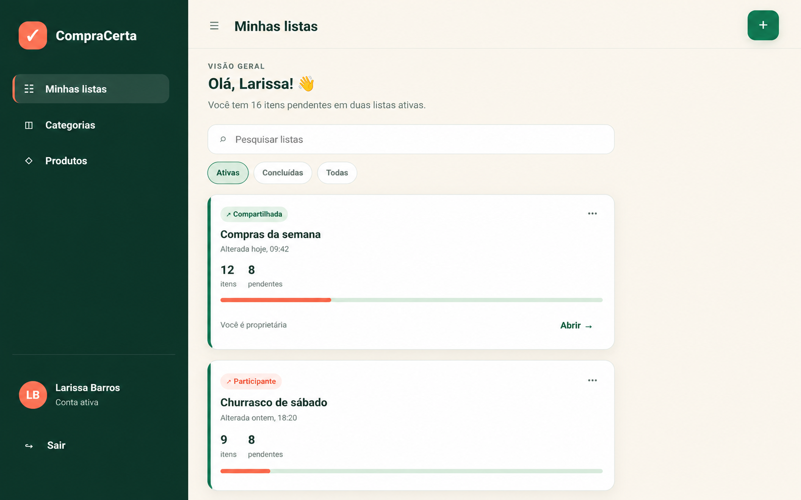
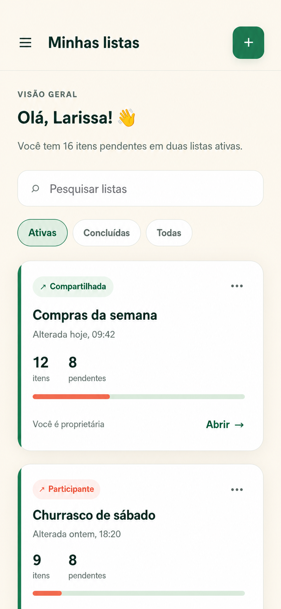
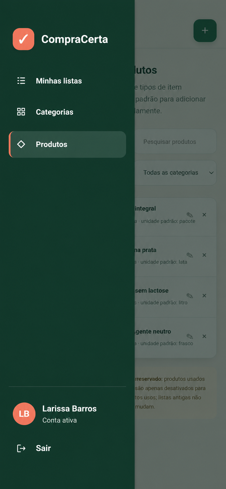

# EF-09 — Navegação da área autenticada

## Visão geral

Oferecer navegação consistente entre todas as páginas autenticadas, identificar o usuário atual e permitir o
encerramento seguro da sessão em layouts desktop e mobile.

## Imagens

|  |  |  |
|:---:|:---:|:---:|
| Figura 1: Menu permanente em desktop | Figura 2: Menu fechado em mobile | Figura 3: Menu aberto em mobile |

## Requisitos

- **Layout da área autenticada (Figuras 1, 2 e 3)**
  - É exibido em todas as páginas que exigem sessão autenticada.
  - Não é exibido nas telas de cadastro, login, recuperação ou redefinição de senha.
  - Mantém a página atual na área de conteúdo sem ocultar informações ou controles.
  - **Marca CompraCerta**
    - Exibe o símbolo e o nome “CompraCerta”.
    - Ao ser acionada, abre “Minhas listas”.
  - **Menu de navegação**
    - Permite acessar “Minhas listas”, “Categorias” e “Produtos”.
    - Mantém a mesma ordem dos destinos em todas as páginas.
    - Destaca somente o destino correspondente à página atual.
    - O destaque usa, além de cor, um indicador visual adicional.
    - **Item “Minhas listas”**
      - Abre `/listas`.
      - Permanece destacado nas páginas de criação, detalhe, edição, itens, execução, ciclo de vida e
        compartilhamento de uma lista.
    - **Item “Categorias”**
      - Abre `/categorias`.
      - Permanece destacado nas páginas de criação e edição de categoria.
    - **Item “Produtos”**
      - Abre `/produtos`.
      - Permanece destacado nas páginas de criação e edição de produto.
  - **Identificação do usuário**
    - Exibe o nome do usuário autenticado.
    - Exibe as iniciais do nome como alternativa visual quando não houver imagem de perfil.
    - Não apresenta papel de uma lista como se fosse uma característica global da conta.
    - Quando os dados da sessão não podem ser recuperados, encerra a área autenticada e abre o login sem
      expor dados da página.
  - **Ação “Sair”**
    - Encerra somente a sessão atual e abre a tela de login.
    - Enquanto processa, não permite uma segunda solicitação.
    - Após o sucesso, voltar ou recarregar não revela conteúdo autenticado.
    - Em caso de falha, mantém a sessão e exibe
      “Não foi possível sair da sua conta. Verifique sua conexão e tente novamente.”.

- **Menu permanente em desktop ou orientação horizontal (Figura 1)**
  - Permanece visível à esquerda durante a navegação e a rolagem do conteúdo.
  - Ocupa a altura disponível da janela sem exigir rolagem própria.
  - Pode compactar tipografia, espaçamentos e marca para permanecer inteiramente visível.
  - Não sobrepõe a área de conteúdo nem produz rolagem horizontal.
  - Mantém identificação do usuário e ação “Sair” próximas à base do painel.

- **Menu recolhível em mobile e orientação vertical (Figuras 2 e 3)**
  - Inicia fechado e oferece um botão com nome acessível “Abrir menu”.
  - Quando aberto, aparece sobre o conteúdo a partir da borda esquerda.
  - Exibe uma camada escurecida sobre o conteúdo sem torná-lo interativo.
  - Fecha ao selecionar um destino, acionar a camada externa ou pressionar `Esc`.
  - Enquanto aberto, mantém o foco dentro do menu e impede a rolagem do conteúdo ao fundo.
  - Ao fechar, devolve o foco ao botão que abriu o menu.
  - O botão passa a ter o nome acessível “Fechar menu” enquanto o painel estiver aberto.

## Requisitos não funcionais

- O menu deve ser implementado como componente compartilhado pelo layout autenticado, sem duplicação entre telas.
- Componentes não acessam o servidor diretamente; consulta e encerramento de sessão são encapsulados em serviço.
- O estado aberto/fechado é local à interface e não exige persistência ou endpoint próprio.
- Links usam navegação interna e preservam o histórico esperado do navegador.
- O layout deve funcionar a partir de 320 px, sem perda de conteúdo, sobreposição indevida ou rolagem horizontal.
- Todos os controles possuem nome acessível, indicador de foco visível e ordem de foco coerente.
- O contraste de textos, ícones, foco, destaque e camada escurecida atende ao WCAG 2.2 nível AA.
- As rotas autenticadas são protegidas antes da renderização; conteúdo anterior não permanece visível após logout.

## Contrato de API

Todos os endpoints exigem cookie de sessão. O encerramento da sessão também exige proteção CSRF.

### Endpoints

| Método e rota | Propósito | Entrada | Sucesso |
|---|---|---|---|
| `GET /api/v1/auth/session` | Obter os dados do usuário exibidos no menu e a validade da sessão | — | `200 SessionResponse` |
| `DELETE /api/v1/auth/sessions/current` | Encerrar a sessão atual | Header `X-CSRF-Token` | `204` e cookie expirado |

### Schemas

| Schemas | Campos e Regras |
|---|---|
| `UserSummary` | `id: uuid`, `name: string` de 2 a 100 caracteres, `email: string` válido, `status: ACTIVE` e `createdAt: date-time`; nunca inclui senha ou segredo |
| `SessionResponse` | `user: UserSummary`, `csrfToken: string` opaco e `expiresAt: date-time`; todos obrigatórios |

As respostas de sessão usam `Cache-Control: no-store`. Sessão ausente, inválida, revogada ou expirada retorna
`401 UNAUTHENTICATED`. CSRF ausente ou inválido no logout retorna `403 CSRF_INVALID`. O frontend apresenta
mensagens polidas e nunca exibe detalhes internos, tokens ou identificadores de rastreamento.

## Testes de validação

| ID | Pri. | Preparação | Ação | Resultado |
|---|---:|---|---|---|
| `NAV-001` | P0 | Usuário autenticado e viewport desktop | Abrir cada rota autenticada | Menu permanente visível, conteúdo íntegro e nenhuma rolagem horizontal |
| `NAV-002` | P0 | Usuário autenticado em qualquer página | Acionar marca e cada item do menu | Destino correto aberto, histórico preservado e somente a seção atual destacada |
| `NAV-003` | P0 | Usuário autenticado com uma página interna aberta | Acionar “Sair”, voltar e recarregar | Uma solicitação, login aberto e nenhum conteúdo protegido revelado |
| `NAV-004` | P0 | Visitante sem sessão | Abrir rotas públicas e autenticadas | Menu ausente nas públicas; internas redirecionam antes de exibir conteúdo |
| `NAV-005` | P0 | Usuário autenticado em viewport 390 × 844 | Abrir menu, navegar por teclado, fechar por destino, camada e `Esc` | Foco contido e restaurado, fundo inativo e rolagem bloqueada enquanto aberto |
| `NAV-006` | P1 | Rotas filhas de listas, categorias e produtos | Navegar diretamente e pelo menu | Destino pai correto permanece destacado em todas as rotas filhas |
| `NAV-007` | P1 | Usuário autenticado com nome conhecido e sem imagem | Abrir qualquer página autenticada | Nome e iniciais corretos, sem atribuir papel de lista à conta |
| `NAV-008` | P1 | Página longa em desktop e janela horizontal de baixa altura | Rolar até o fim | Menu permanece visível, inteiro e sem rolagem própria |
| `NAV-009` | P1 | Falhas controladas na consulta da sessão e no logout | Abrir área interna e tentar sair | Consulta inválida protege conteúdo; falha no logout mantém sessão e mostra mensagem polida |
| `NAV-010` | P2 | Viewports e navegadores suportados | Verificar zoom, teclado, contraste e leitores de tela | Layout responsivo e controles atendem aos requisitos de acessibilidade |
