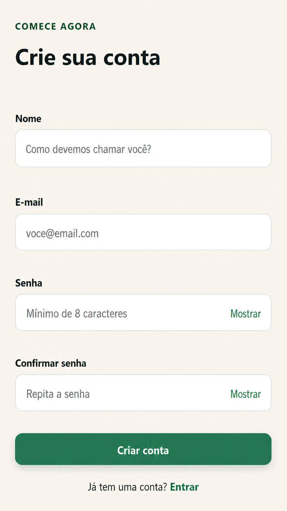
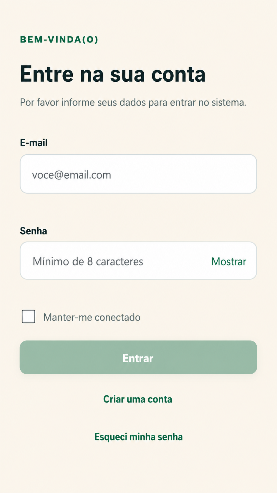

# CompraCerta

## Manual do usuário

**Versão 1 — julho de 2026**

O CompraCerta ajuda você a planejar compras, organizar produtos por categoria, acompanhar itens já comprados e colaborar com outras pessoas.

> As telas podem apresentar pequenas diferenças conforme o tamanho do dispositivo. Os nomes dos botões e as ações permanecem os mesmos.

## Sumário

1. Primeiros passos
2. Acessar sua conta
3. Navegar pelo CompraCerta
4. Organizar suas listas
5. Adicionar e editar itens
6. Realizar uma compra
7. Concluir, reabrir e excluir listas
8. Organizar categorias e produtos
9. Compartilhar e colaborar
10. Resolver situações comuns
11. Dúvidas frequentes

# 1. Primeiros passos

## 1.1 Criar uma conta

1. Na tela de entrada, selecione **Criar uma conta**.
2. Informe seu nome e um endereço de e-mail válido.
3. Crie uma senha que atenda aos critérios apresentados.
4. Digite a mesma senha em **Confirmar senha**.
5. Selecione **Criar conta**.

Após o cadastro, o sistema abre sua área de listas. Se algum dado não for aceito, corrija o campo indicado pela mensagem exibida.

*Figura 1 — Cadastro de usuário.*

## 1.2 Entrar

1. Informe o e-mail cadastrado.
2. Informe sua senha. Use o ícone do campo para mostrar ou ocultar o conteúdo.
3. Selecione **Entrar**.

Credenciais válidas levam à tela **Minhas listas**. Por segurança, o sistema não informa se o e-mail ou a senha foi digitado incorretamente.

*Figura 2 — Entrada no CompraCerta.*

## 1.3 Recuperar a senha

1. Na tela de entrada, selecione **Esqueci minha senha**.
2. Informe o e-mail da conta e envie a solicitação.
3. Abra a mensagem recebida e acesse o link de redefinição.
4. Digite e confirme a nova senha.
5. Conclua a redefinição e entre novamente.

O sistema apresenta uma confirmação genérica mesmo quando o e-mail não está cadastrado. Links inválidos, expirados ou já utilizados precisam ser substituídos por uma nova solicitação.

## 1.4 Sair

1. Abra o menu principal.
2. Selecione **Sair**.

A sessão é encerrada e a tela de entrada volta a ser exibida. Em um dispositivo compartilhado, sempre encerre a sessão ao terminar.

# 2. Navegar pelo CompraCerta

## 2.1 Menu no computador

No computador, o menu permanece visível à esquerda. Use-o para acessar **Minhas listas**, **Categorias**, **Produtos** ou **Sair**.

*Figura 3 — Navegação no computador.*

## 2.2 Menu no celular

No celular, selecione o botão de menu no canto superior para abrir as opções. Selecione uma opção ou toque fora do painel para fechá-lo.

*Figura 4 — Botão do menu no celular.*

*Figura 5 — Opções de navegação no celular.*

> O botão **Voltar** do navegador retorna à tela anterior sem encerrar sua sessão.

# 3. Organizar suas listas

## 3.1 Consultar listas

A tela **Minhas listas** reúne todas as listas próprias e compartilhadas às quais você tem acesso.

1. Use as opções de status para alternar entre listas ativas e concluídas.
2. Localize a lista desejada pelo nome e pelas informações do cartão.
3. Selecione o cartão para abrir seus detalhes.

Listas compartilhadas indicam sua participação. Listas concluídas aparecem separadas ou visualmente atenuadas.

*Figura 6 — Listas disponíveis.*

## 3.2 Criar uma lista

1. Em **Minhas listas**, selecione **Nova lista** ou o botão de adição.
2. Informe um nome claro para a compra.
3. Selecione **Salvar**.

A nova lista é criada vazia e sua tela de detalhes é aberta. Se desistir, selecione **Cancelar**.

*Figura 7 — Criação de uma lista.*

## 3.3 Editar o nome de uma lista

1. Abra a lista.
2. Abra o menu de ações e selecione **Editar lista**.
3. Altere o nome.
4. Selecione **Salvar**.

Somente o proprietário pode realizar ações reservadas à administração da lista.

# 4. Adicionar e editar itens

## 4.1 Conhecer a tela da lista

A tela de detalhes apresenta o resumo da compra e agrupa os itens por categoria. Cada item mostra produto, quantidade, unidade e observação, quando informada.

*Figura 8 — Itens agrupados por categoria.*

## 4.2 Adicionar um item

1. Abra a lista desejada.
2. Selecione **Adicionar item**.
3. Pesquise e selecione um produto existente.
4. Informe a quantidade e a unidade.
5. Confira ou altere a categoria sugerida.
6. Acrescente uma observação, se necessário.
7. Selecione **Adicionar**.

*Figura 9 — Inclusão de item.*

Ao pesquisar um produto, selecione uma das sugestões. A categoria padrão do produto é preenchida automaticamente.

*Figura 10 — Seleção de produto existente.*

## 4.3 Tratar um produto repetido

Se o produto já estiver na lista, o CompraCerta avisa antes de criar uma duplicidade. Escolha a ação oferecida pela tela, como atualizar o item existente ou cancelar a inclusão.

*Figura 11 — Tratamento de produto repetido.*

## 4.4 Editar um item

1. Abra a lista.
2. Selecione o item ou sua ação de edição.
3. Altere quantidade, unidade, categoria ou observação.
4. Selecione **Salvar**.

*Figura 12 — Edição de item.*

## 4.5 Remover um item

1. Abra a edição ou o menu do item.
2. Selecione **Remover**.
3. Confirme a exclusão.

*Figura 13 — Confirmação de remoção.*

> A remoção não pode ser desfeita. Confira o produto antes de confirmar.

# 5. Realizar uma compra

## 5.1 Marcar produtos comprados

1. Abra a lista durante a compra.
2. Selecione a caixa do item encontrado.
3. Repita a ação para cada produto.

O item comprado recebe uma indicação além da cor, e os totais e o progresso são atualizados automaticamente. Se marcou por engano, selecione novamente para devolver o item ao estado pendente.

## 5.2 Acompanhar alterações de outra pessoa

Em uma lista compartilhada, alterações feitas por participantes são sincronizadas. Quando houver atualização disponível, a tela apresenta o estado mais recente sem substituir silenciosamente mudanças conflitantes.

## 5.3 Continuar após perda de conexão

Se a conexão cair, o CompraCerta informa que não conseguiu sincronizar a alteração. Mantenha a tela aberta, recupere a conexão e tente novamente conforme a orientação exibida.

*Figura 14 — Alteração ainda não sincronizada.*

## 5.4 Resolver conflito de atualização

Um conflito ocorre quando outra pessoa altera o mesmo conteúdo antes de você salvar.

1. Leia o aviso apresentado.
2. Atualize os dados para receber a versão mais recente.
3. Confira a alteração da outra pessoa.
4. Refaça sua mudança, se ainda for necessária.

*Figura 15 — Conflito entre alterações.*

# 6. Concluir, reabrir e excluir listas

## 6.1 Concluir uma lista

1. Abra uma lista ativa.
2. Abra o menu de ações.
3. Selecione **Concluir lista**.
4. Confirme a ação.

*Figura 16 — Conclusão da compra.*

Uma lista concluída fica disponível para consulta e não aceita alterações em seus itens.

*Figura 17 — Consulta de lista concluída.*

## 6.2 Reabrir uma lista

1. Abra uma lista concluída.
2. Selecione **Reabrir lista**.
3. Confirme a ação.

*Figura 18 — Reabertura de uma lista.*

A lista volta ao estado ativo e seus itens podem ser alterados novamente.

## 6.3 Excluir uma lista

1. Abra a lista.
2. Abra o menu de ações e selecione **Excluir lista**.
3. Confira o nome apresentado.
4. Confirme a exclusão.

*Figura 19 — Exclusão de uma lista.*

> Somente o proprietário pode excluir a lista. A exclusão remove o acesso de todos os participantes e não pode ser desfeita pela interface.

# 7. Organizar categorias e produtos

## 7.1 Consultar categorias

Abra o menu principal e selecione **Categorias**. Use a pesquisa para localizar uma categoria.

*Figura 20 — Categorias cadastradas.*

## 7.2 Criar uma categoria

1. Em **Categorias**, selecione **Nova categoria**.
2. Informe um nome.
3. Selecione **Salvar**.

*Figura 21 — Criação de categoria.*

Nomes equivalentes, mesmo com diferenças de letras maiúsculas, acentos ou espaços, não podem ser repetidos.

## 7.3 Editar uma categoria

1. Localize a categoria.
2. Selecione **Editar**.
3. Altere o nome e selecione **Salvar**.

*Figura 22 — Edição de categoria.*

Uma categoria vinculada a produtos não pode ser removida até que os vínculos sejam tratados conforme a mensagem apresentada.

## 7.4 Consultar produtos

Abra o menu principal e selecione **Produtos**. Pesquise pelo nome ou filtre por categoria.

*Figura 23 — Catálogo de produtos.*

## 7.5 Criar um produto

1. Em **Produtos**, selecione **Novo produto**.
2. Informe o nome.
3. Escolha a categoria padrão.
4. Informe a unidade padrão, se aplicável.
5. Selecione **Salvar**.

*Figura 24 — Criação de produto.*

## 7.6 Editar ou desativar um produto

Para editar, localize o produto, selecione **Editar**, altere os dados e salve. A nova categoria padrão não modifica itens antigos.

*Figura 25 — Edição de produto.*

Produtos já usados são desativados em vez de apagados do histórico. Confirme a desativação somente quando o produto não deva mais aparecer em novas inclusões.

*Figura 26 — Desativação de produto.*

# 8. Compartilhar e colaborar

## 8.1 Convidar uma pessoa

Somente o proprietário administra participantes.

1. Abra a lista.
2. Abra o menu de ações e selecione **Compartilhar**.
3. Informe o e-mail da pessoa.
4. Selecione **Convidar**.

*Figura 27 — Participantes e convites da lista.*

O convite informa a lista, o proprietário e sua situação. O mesmo e-mail não pode receber convites ativos repetidos para a mesma lista.

*Figura 28 — Convite recebido.*

## 8.2 Aceitar um convite

1. Abra o link recebido.
2. Entre ou crie uma conta usando o e-mail convidado.
3. Selecione **Aceitar convite**.

Após o aceite, a lista aparece em **Minhas listas**. Convites cancelados, expirados ou já utilizados não podem ser aceitos.

## 8.3 Remover um participante

1. Abra **Compartilhar**.
2. Localize o participante.
3. Selecione **Remover**.
4. Confirme a ação.

*Figura 29 — Remoção de participante.*

A pessoa perde o acesso, mas as alterações que ela já realizou permanecem na lista.

## 8.4 Sair de uma lista compartilhada

1. Abra a lista compartilhada.
2. Abra o menu de ações.
3. Selecione **Sair da lista**.
4. Confirme.

*Figura 30 — Saída de uma lista compartilhada.*

O proprietário não pode sair da própria lista. Ele pode remover participantes ou excluir a lista.

# 9. Resolver situações comuns

## 9.1 Um botão está desabilitado

Confira se todos os campos obrigatórios foram preenchidos corretamente. Durante um envio, o botão também fica temporariamente indisponível para evitar operações repetidas.

## 9.2 Uma mensagem de validação apareceu

Leia a mensagem junto ao campo, preserve os demais dados e corrija apenas o valor indicado. O servidor repete as validações para proteger seus dados.

## 9.3 A sessão expirou

Entre novamente. Por segurança, operações iniciadas depois da expiração não são concluídas automaticamente.

## 9.4 Uma lista ou um item não foi encontrado

O conteúdo pode ter sido excluído ou seu acesso pode ter sido removido. Volte para **Minhas listas** e atualize a página.

## 9.5 Uma lista concluída não aceita alterações

Peça ao proprietário que reabra a lista. Depois da reabertura, os participantes voltam a editar os itens.

## 9.6 O convite não funciona

Confirme se você entrou com o mesmo e-mail que recebeu o convite. Se ele estiver expirado ou cancelado, solicite um novo convite ao proprietário.

# 10. Dúvidas frequentes

## Posso usar o CompraCerta no celular?

Sim. Todas as funções principais estão disponíveis a partir de 320 pixels de largura. No celular, a navegação fica recolhida no botão de menu.

## Duas pessoas podem comprar ao mesmo tempo?

Sim. Participantes ativos podem marcar e editar itens. Se duas alterações incompatíveis ocorrerem ao mesmo tempo, o sistema pede que os dados sejam atualizados antes de salvar novamente.

## Posso editar uma lista concluída?

Não. Primeiro, o proprietário precisa reabri-la.

## A exclusão pode ser desfeita?

Não pela interface. Leia a confirmação antes de excluir listas ou itens.

## O participante pode convidar outras pessoas?

Não. Apenas o proprietário administra participantes e convites.

## Alterar um produto muda minhas listas antigas?

Não. Alterações no catálogo valem para novos usos e não reescrevem o histórico.

## Preciso salvar quando marco um item como comprado?

Não há um botão adicional. A seleção do item dispara a atualização; aguarde a confirmação visual e observe avisos de conexão.

# 11. Boas práticas

- Use nomes de listas que indiquem o objetivo ou a data da compra.
- Cadastre produtos genéricos e use a observação para marca, sabor ou restrições.
- Evite criar categorias muito semelhantes.
- Antes de concluir uma lista compartilhada, confirme se todos terminaram.
- Não compartilhe links de recuperação de senha ou convites fora do destinatário previsto.
- Encerre a sessão em dispositivos compartilhados.

---

**CompraCerta — Manual do usuário, versão 1.**
